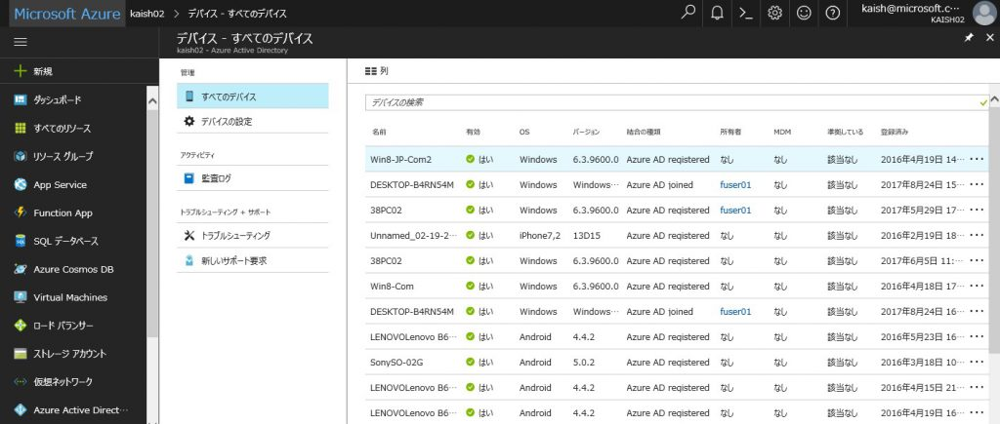

> [!NOTE]
> 本記事は Technet Blog の更新停止に伴い https://blogs.technet.microsoft.com/jpazureid/2017/11/27/registerd_device_managemant/ の内容を移行したものです。
> 元の記事の最新の更新情報については、本内容をご参照ください。

# 登録されたデバイスの管理方法

こんにちは、Azure & Identity サポート チームの石川です。
今回は、Azure AD に登録されているデバイスの管理方法について紹介します。

Azure AD にデバイスを登録しておくことで、条件付きアクセスでデバイス登録されていることを条件にアクセス制御をすることができますが、過去に使用していたデバイスを廃棄したり、別ユーザーに譲渡したりした場合、Azure AD 上のユーザーに紐づいたデバイス情報が残ったままになってしまうことがあります。

Azure ポータルのデバイスの管理画面でもデバイスの削除はできますが、複数のデバイスをまとめて削除するなどの操作は、現時点では実装されておりません。

そこで、PowerShell を利用することで、条件に合致したデバイスをまとめて管理することができますので、その方法を紹介します。

Azure ポータルのデバイス管理画面:


## PowerShell で、条件に合致したデバイスを一括で削除する方法

今回は、例として、「長時間サインインしていないデバイス」を抽出して、削除する方法を紹介します。

手順

1. まず、Azure AD PowerShell をダウンロードし、インターネットに接続している任意の端末にインストールします。

Azure AD PowerShell の入手方法は、こちらをご参照ください。

https://blogs.technet.microsoft.com/jpazureid/2017/12/04/aad-powershell/

2. 管理者として Azure AD PowerShell を実行します。

3. 起動した PowerShell で次のコマンドを実行して、Azure AD にサインインします。

'''
Connect-MsolService
'''

※認証ダイアログが表示されますので、Azure AD の管理者アカウントの資格情報を入力して [OK] ボタンをクリックします。

4. 下記のコマンドを入力し、ユーザーを指定して、ユーザーに紐づくデバイス情報の詳細を確認します。

```
Get-MsolDevice -RegisteredOwnerUpn <UPN> | ft Displayname, DeviceId,ApproximateLastLogonTimestamp
```

次のような結果が返るので、ApproximateLastLogonTimestamp 属性値を基に、長期間 Azure AD へのサインインに利用されていないデバイスを判断します。

※   ApproximateLastLogonTimestam は、そのデバイスを使用して最後にサインインした日時の情報となります。


5. 下記のコマンドを実行して、デバイスを指定して削除します。

```
Remove-MsolDevice  -DeviceId <4. で確認した DeviceId> -force
```

６．上記のコマンドを応用して、例えば、特定ユーザーの ApproximateLastLogonTimestam  が 1 年以上前のデバイスを一括削除する場合、次のような構文を使用します。

```
Get-MsolDevice -RegisteredOwnerUpn <UPN> | where {$_.ApproximateLastLogonTimestamp.AddYears(1) -lt (Get-Date)} | foreach{Remove-MsolDevice -DeviceId $_.DeviceId} -force
```

７．また、ディレクトリ内のすべての ApproximateLastLogonTimestam  が 1 年以上前のデバイスを一括削除する場合は、次のような構文を使用します。

```
Get-MsolDevice -All | where {$_.ApproximateLastLogonTimestamp.AddYears(1) -lt (Get-Date)} | foreach{Remove-MsolDevice -DeviceId $_.DeviceId} -force
```

- 注意事項

削除したデバイスを管理者が元に戻すことはできないため、ユーザーが再登録する必要があります。

Get-MsolDevice -RegisteredOwnerUpn で削除対象をなるデバイスを抽出した後、使用者に実際にデバイスを使用していないことを確認した上で、削除することをお勧めいたします。

いかがでしたでしょうか？

今回ご紹介した PowerShell によるデバイスの管理方法はほんの一例となりますため、別の条件での管理方法を知りたいなどのご質問があれば、Azure サポートにお問い合わせをいただければ幸いです。

また、お客様のご利用方法に則した構文やスクリプトの作成支援などは、弊社プレミア サポートにて承っておりますので、ぜひご利用ください。

サポートにお問い合わせする方法について

