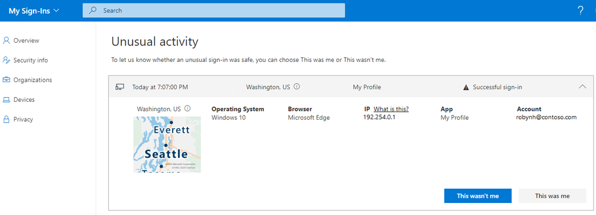
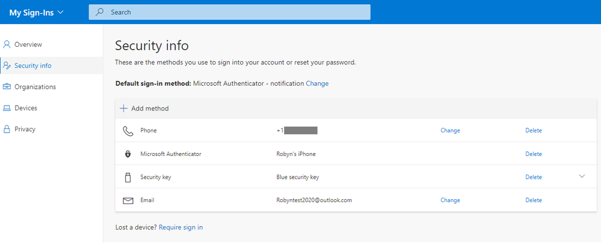
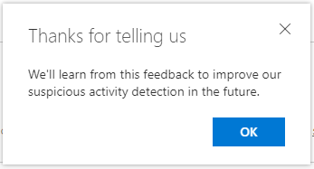
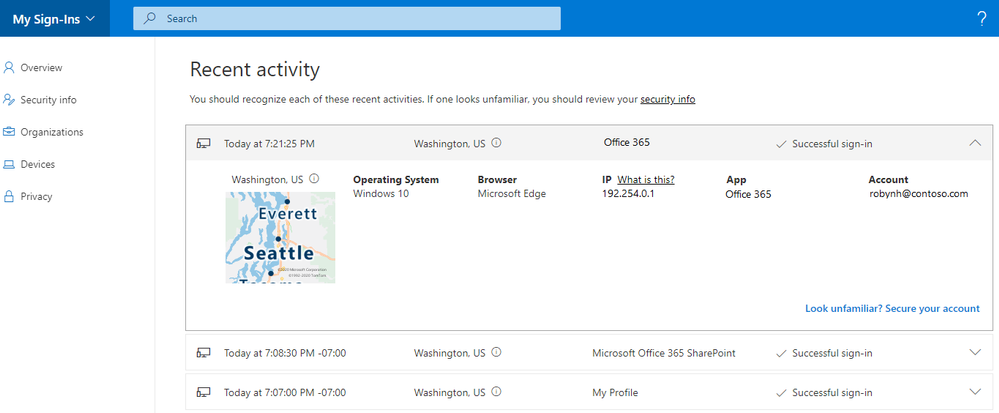
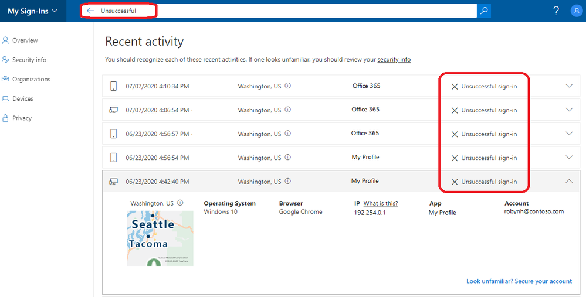
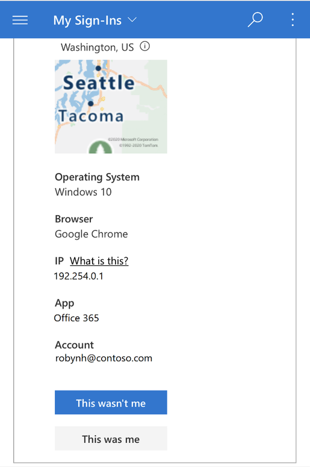

# 通常とは異なるサインインが発生した場合に "これは私ではありません" と報告する。

本記事は、 2020 年 8 月 3 日に Azure Active Directory Identity Blog に公開された記事 (End users can now report “This wasn’t me” for unusual sign-in activity) の抄訳です。原文は [こちら](https://techcommunity.microsoft.com/t5/azure-active-directory-identity/end-users-can-now-report-this-wasn-t-me-for-unusual-sign-in/ba-p/1257369) より参照ください。

---

[Azure AD My Sign-Ins](https://mysignins.microsoft.com/) が利用できるようになりました。パブリック プレビューの [blog post](https://techcommunity.microsoft.com/t5/azure-active-directory-identity/users-can-now-check-their-sign-in-history-for-unusual-activity/ba-p/916066) にありますように、**[自分のサインイン]** ページで、次の情報を確認することができます。

* だれかがパスワードを推測しようとしているような痕跡。
* 普段の利用場所とは異なるところから攻撃者が自分のアカウントへのサインインに成功したこと。
* 攻撃者がアクセスしようとしたアプリ。

加えて、エンドユーザーが通常とは異なるサインインが発生した場合に "これは私ではありません" または "これは私です" と報告することができるようになりました。

以下で[My Sign-Ins](https://mysignins.microsoft.com/) ページにおけるアップデートの詳細を紹介します。ユーザーはサインインが自分のものかどうかを My Sign-Ins ページにある各セクションで簡単に判断することができます。

## 通常とは異なるアクティビティ (Unusual activity)

[Identity Protection](https://docs.microsoft.com/ja-jp/azure/active-directory/identity-protection/overview-identity-protection) で検出した不審なアクティビティを確認できる項目です。たとえば、危険なサインインが自動的に検出された場合、"Unusual Activity" のセクションで、そのサインインが画面の上方へ表示されます。

また、 "This wasn't me" と "This was me" ボタンが追加されました。ユーザーが "This wasn't me" (これは私ではありません) を選択すると、次のダイアログボックスが表示されます。

自身のサインインではない、つまり不正なアクセスによるものと考えられるため、認証方法を確認して更新するために [Security info](https://mysignins.microsoft.com/security-info) ページに移動します。セキュリティ情報管理の詳細については、[Combined MFA and password reset registration](https://techcommunity.microsoft.com/t5/azure-active-directory-identity/combined-mfa-and-password-reset-registration-is-now-generally/ba-p/1257355) のブログ記事を参照してください。

ユーザーが "This was me" を選択すると、次のダイアログボックスが表示されます。

エンドユーザーからのフィードバックは、リスク検出システムの精度を向上させる手助けとなります。そのフィードバックによって [Identity Protection](https://docs.microsoft.com/ja-jp/azure/active-directory/identity-protection/overview-identity-protection) でのリスク状態の変更が許可される前に、ユーザーからのフィードバックを学習します。管理者は、ユーザーが検出された通常とは異なるアクティビティに対して  "This wasn't me" と "This was me" のどちらを選択したかは [監査ログ](https://docs.microsoft.com/ja-jp/azure/active-directory/reports-monitoring/concept-audit-logs) から確認できます。その監査ログに記録された情報を参考にして検出されたリスクを無視できるものとしてマークするか、何らかの対処をおこなうかを決定します。

## 最近のアクティビティ (Recent activity)

特に不審なサインインがない場合は、"Recent activity" セクションのみが表示されます。ユーザーは通常のサインインを確認し、覚えがないものがある場合は "Look unfamiliar? Secure your account" をクリックして、報告することができます。

ユーザーは、他の誰かが自分のパスワードを推測しようとしているかどうかを確認することもできます。その場合、次のように "Unsuccessful sign-in" と表示されます。

## 検索とフィルタリング

また、不要な情報をフィルタするために、上部の検索バーを使用して、サインインに失敗したサインインのみを確認できます。

また、検索バーを使用して、アプリ、ブラウザ、場所、オペレーティング システムなどの他の詳細をフィルタリングすることもできます。
 
最後に、モバイル端末からでもこれらの情報を確認できます！

個人のメールについても興味がある場合は、コンシューマー Microsoft アカウントで [https://account.live.com/activity](https://account.live.com/activity) の [最近のアクティビティ] ページをご覧ください。

## フィードバック
以下のコメント欄または [Azure AD フィードバック フォーラム](http://aka.ms/AzureADFeedback)でご意見をお聞かせください。
