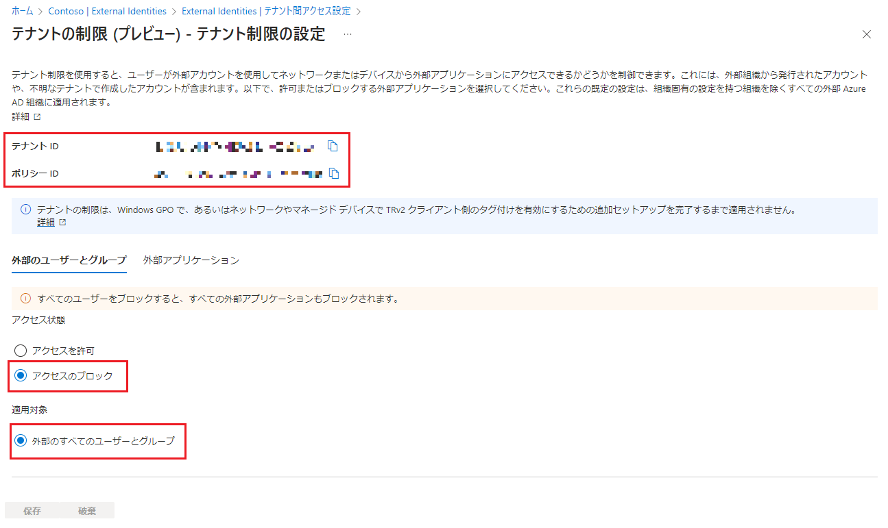
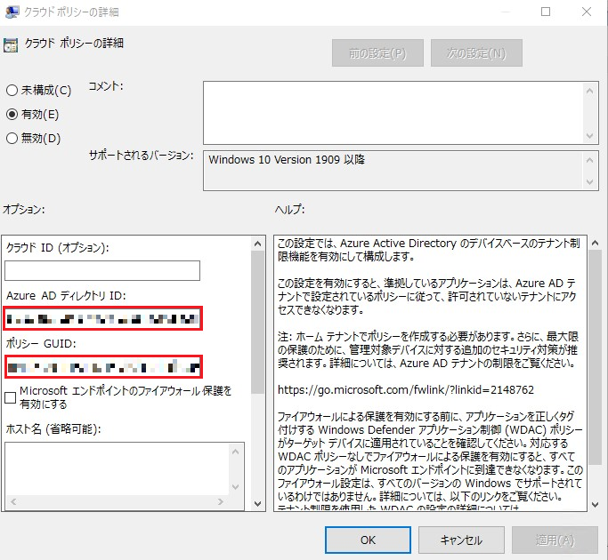

# テナント制限 v2 がパブリック プレビューになりました

こんにちは、Azure Identity サポート チームの 五十嵐 です。
本記事は、2023 年 5 月 25 日に米国の Azure Active Directory Identity Blog で公開された [Tenant Restriction v2 is now Public Preview!](https://techcommunity.microsoft.com/t5/microsoft-entra-azure-ad-blog/tenant-restriction-v2-is-now-public-preview/ba-p/3094113) を意訳したものになります。ご不明点等ございましたらサポート チームまでお問い合わせください。

---

みなさま、こんにちは。

この度、当社の商用クラウドにおいて、テナント制限 v2 (TRv2) のパブリック プレビューを開始することになりましたことをお知らせいたします！

TRv2 の利用により、データ流出リスクを抑えつつ、安全で生産的な企業間コラボレーションを実現することができます。テナント制限の設定では、外部で発行された ID を使用して、ユーザーが自社のデバイスやネットワークからアクセスできる外部テナントを制御し、組織、ユーザー、グループ、アプリケーション単位できめ細かいアクセス制御を提供することができます。

テナント制限は、以前リリースされた [外部コラボレーション用のクロステナント アクセス設定](https://techcommunity.microsoft.com/t5/microsoft-entra-azure-ad-blog/collaborate-more-securely-with-new-cross-tenant-access-settings/ba-p/2147077) (日本語訳したブログは [こちら](./azure-active-directory/collaborate-more-securely-with-new-cross-tenant-access-settings/) ) に待望の拡張を加えたものです。これらを組み合わせることで、企業間のセキュリティとコラボレーション ポリシーを最も細かく制御することができます。

TRv2 への対応については、Microsoft Entra のプロダクト マネージャーである Vimala Ranganathan 氏を招き、詳細を説明いたします。

よろしくお願いいたします。

Robin Goldstein (Twitter: @RobinGo_MS)
Partner Director of Product Management
Microsoft Identity Division

---

みなさま、こんにちは。

今回は私 Vimala がテナント制限 v2 (TRv2) について説明いたします。

弊社では、M365 クラウド サービスに移行するお客様、特に組織の境界を越えてコラボレーションする必要があるお客様にとって、データの流出が大きな懸念事項であると伺っています。TRv2 はこのような懸念に対応するもので、トークンの悪用による侵入や、外部の SharePoint オンラインのデータへの匿名アクセス、外部の Teams 会議への匿名参加などによる情報漏えいを防ぎ、安全な外部コラボレーションを実現します。

現行のテナント制限はオンプレミスのプロキシ サーバーを使用しており、Azure Active Directory (Azure AD) によるクラウド認証時にのみ強制されていましたが、TRv2 はこれを改良しています。テナント制限 v2 を使用することで、外部組織から発行されたアカウントや未知のテナントで作成されたアカウントなどを含め、外部で発行された ID を使用してユーザーがネットワークやデバイスから外部アプリケーションにアクセスできるかどうかを管理者が制御できるようになります。

TRv2 はクラウド ポリシーを使用し、認証とデータ プレーン保護の両方を提供します。ユーザー認証時に加え、 Exchange Online、SharePoint Online、Teams、MS Graph などデータ プレーンへのアクセス時にもポリシーを適用することができます。

## テナント制限 v2 (TRv2)

TRv1 とは異なり、TRv2 では組織が所有するデバイス上および組織のネットワーク上で、外部発行の ID を使用してユーザーがどの外部テナントにアクセスできるかをテナント管理者が制御することができます。

例えば、Alice は Contoso 社の社員で、Fabrikam 社とコンサルティング業務を行っています。Fabrikam 社は Alice が Fabrikam 社のリソースにアクセスするために、ユーザー アカウントを発行します。Alice は Contoso 社のネットワークで Contoso 社が発行したデバイスを使用しながら、Fabrikam 社のリソースにアクセスする必要があります。Contoso 社の管理者である Cathy は、Alice の Fabrikam 社のアカウントへのアクセスを可能にする以外は、自身の組織のデバイスからの他のすべての外部 ID を使用したアクセスをブロックすることによって、データ流出のリスクを抑制したいと考えています。TRv2 の機能により、Alice は Contoso 社の完全な管理下にありながら、組織の境界を越えて活動することができます。

## テナント制限 v2 (TRv2) のメリット

TRv2 は以下の機能を提供します:

- すべての外部テナントに適用される既定のポリシー設定。
- 外部テナントに対する、連携組織ごとのコラボレーション ポリシーの作成。
- 外部で発行されたユーザー ID が他の組織にアクセスする方法の制御。
- 特定の組織の特定のユーザーとグループのみにアクセス許可を制限。
- ユーザーが外部組織で発行された ID を使用してアクセスできるようにさせたい外部組織のすべてのアプリまたは特定のアプリの指定。
- 許可されていないテナントの認証リクエストは、Azure AD でブロックされる - **Auth プレーン保護**。
- MS クラウド サービスでは、リソース アクセスにテナント制限のポリシーを強制 - トークンの悪用による侵入を防ぐ **データ プレーン保護**。
- Teams 会議への **匿名アクセスをブロックし**、匿名で共有されたリソース (リンクがあればアクセスできる) へのアクセスをブロック。
- Exchange Online の基本認証が許可されている場合でも、外部テナントへのアクセスをブロック。
- Azure Active Directory (AAD) への通信を許可するのに社内プロキシに許可テナントを追加する工数が不要。
- クラウド ポリシーを設定するためにポータル UX をサポート。

## テナント制限ポリシーの設定

1. 既定の TRv2 ポリシーを設定:

Contoso 社は、ユーザーが Contoso 社のネットワークとデバイスを使用しながら、パートナーと連携する方法を制限したいとします。Contoso 社の管理者 Cathy は、まず、すべての連携先テナントに適用される既定のポリシーを設定します。既定のポリシーでは、管理者はすべての外部テナント、およびすべての外部ユーザーとグループへのアクセスをブロックします。

2. テナント固有の TRv2 ポリシーを設定:

Contoso 社の管理者である Cathy は、Fabrikam 社固有のポリシーを設定し、Alice のみが Fabrikam 社の ID を使用して Office 365 などの特定のアプリケーションにアクセスすることを許可します。

3. デバイスにてクライアント側の TRv2 を有効化:

テナント管理者、Cathy は Windows GPO のポリシーの詳細画面で、TRv2 クラウド ポリシーのテナント ID とポリシー ID を設定します。これにより、Contoso 社の全デバイスから、Microsoft への送信リクエストに対し、OS が TRv2 ポリシーへの参照を挿入するようになります。

上記の設定により、Contoso 社の管理者は、Contoso 社のデバイスやネットワークから外部 ID を使用した外部テナントへのアクセスをすべてブロックし、加えて Fabrikam 社に対する固有のポリシーにより、Alice にのみ Alice の Fabrikam 社の ID を使用して Fabrikam 社の Office365 アプリケーションへアクセスすることを許可しました。

## 自社のデバイスやネットワークから外部組織のリソースにアクセスしている人を把握する

サインイン ログから、Contoso 社の管理者は Contoso 社のユーザーがどの外部テナントを使って外部組織にアクセスし、ブロックされているかを確認することができます。

クロステナント アクセス設定にあるテナント制限 v2 の詳細については [ドキュメント](https://learn.microsoft.com/ja-jp/azure/active-directory/external-identities/tenant-restrictions-v2#step-3-enable-tenant-restrictions-on-windows-managed-devices) をお読みください。

ありがとうございました。

Vimala
