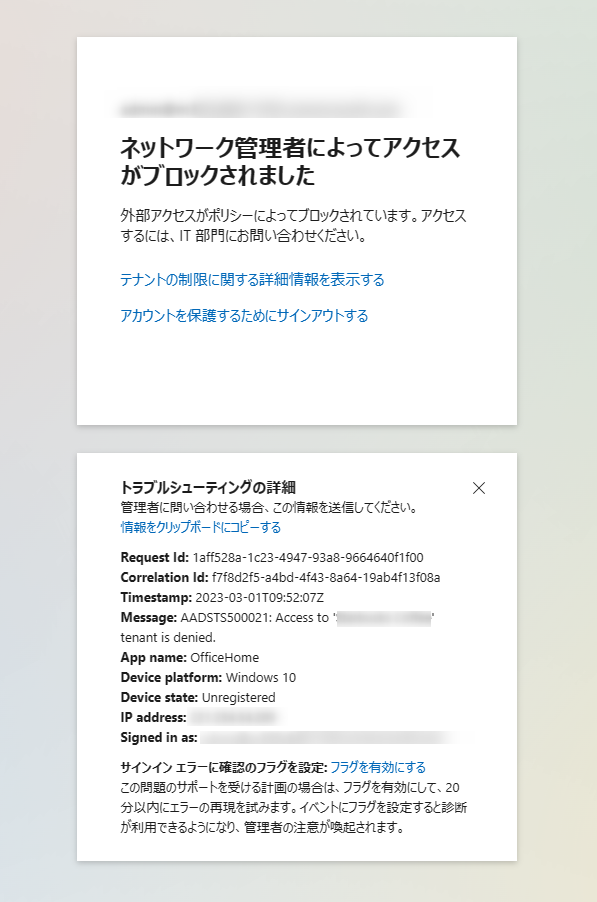
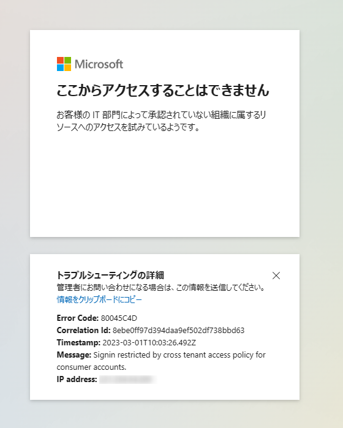

> [!NOTE]
> 本記事は Technet Blog の更新停止に伴い https://blogs.technet.microsoft.com/jpazureid/2018/09/13/tenant-restrictions/ の内容を移行したものです。
> 
> また本記事は 2018 年に公開したものですが、サポートへのお問い合わせ状況ならびにエラー画面の変更などをふまえ、2023 年 6 月時点での最新の情報にアップデートいたしました。

# テナント制限について

こんにちは！ Azure & Identity サポート チームの栗井です。

今回は Azure AD のテナント制限の機能に関して、よくあるお問い合わせと、その回答をご紹介いたします。

## テナント制限とは

テナント制限の機能では、ユーザーがアクセス可能な Azure AD テナントを制限することが可能です。

具体的には、クライアント端末から Azure AD に対する認証の通信をプロキシ経由させ、そのプロキシから送信されるデータに許可対象の Azure AD テナントの情報を付与します。その結果、それ以外の Azure AD テナントへのアクセスがブロックされる動作となります。

テナント制限の機能の詳細については、以下の公開情報をご参照ください。

- [公開情報: テナント制限を使用して SaaS アプリへのアクセスを管理する - Microsoft Entra | Microsoft Learn](https://learn.microsoft.com/ja-jp/azure/active-directory/manage-apps/tenant-restrictions)

テナント制限によって許可されていないテナントへアクセスを試行すると、下記のように 「ネットワーク管理者によってアクセスがブロックされました」というエラーメッセージが表示されます (エラーコード: AADSTS500021)。

以下にて、テナント制限に関連する FAQ をまとめました。ぜひご参照ください！

## よくあるお問い合わせ
Q : テナント制限の機能のライセンス要件はありますか？

A : テナント制限のご利用には、Azure AD Premium P1 もしくは P2 相当のライセンスが必要です。

テナント制限に関する公開情報の中では、Azure AD Premium のライセンスが無くとも、利用の状況・条件によってはテナント制限の利用が可能と受け取れる記載が 2020 年までございました。

この公開情報をもとに 2017 年に発行された日本語でのブログ記事 (現在はアーカイブ済み) においても、ライセンスに関する適切ではない記述がありましたが、 Azure AD Premium のライセンスが必要となります点ご留意ください。

Q : Microsoft アカウント (コンシューマー向けアカウント) によるアクセスを制限することは可能ですか。

A : はい、可能です。この場合は login.live.com 宛への通信に対してヘッダーを設定しますが、 “Restrict-Access-To-Tenants" とは異なるヘッダーを利用します。

Microsoft アカウントによるアクセスを制限する場合は、"sec-Restrict-Tenant-Access-Policy" ヘッダーに "restrict-msa" という値が含まれるように構成ください。
この設定によって、 Microsoft アカウントの認証エンドポイント (login.live.com) へのアクセスがブロックされます。

アクセス ブロック時のメッセージとエラーコードは下記の通りです。
- メッセージ: "ここからアクセスすることはできません お客様の IT 部門によって承認されていない組織に属するリソースへのアクセスを試みているようです。" 
- エラーコード: 80045C4D

Q : 制限されるのは Office 365 だけですか？

A  : いいえ。以下の認証エンドポイントを使用する、すべてのサービス、言い換えますと Azure AD と連携するサービスが制限されます。

- login.microsoftonline.com  
- login.windows.net  
- login.microsoft.com

例えば Azure ポータル、EA ポータルにアクセスする際も制限されます。また、ゲストユーザーの場合、招待されたテナントではなく、管理元のテナントで認証が行われるため、ゲストユーザーの招待元テナントも、テナント制限で許可する必要があります。

Q : (クライアントですが)、テナント制限によってアクセスできないテナントにアクセスできるようにしてほしい。

A : 接続元のクライアントが利用するプロキシサーバーの設定変更が必要です。プロキシ サーバーを管理している IT 部門へ申請をあげるなどで、テナント制限の許可するリストに該当のテナントを追加してもらってください。

テナント制限は設定をおこなったプロキシ経由でのアクセスに制限を加えるものですので、プロキシサーバーによる制限を受けないネットワーク環境から接続することでもテナント制限による制御は回避できます。

Q : Azure AD 側での設定変更は必要ですか？

A : いいえ。プロキシの設定のみで、テナント制限が機能します。

Q : "Restrict-Access-To-Tenants" に、ワイルドカードは利用できますか？

A : いいえ。テナント名かテナント ID を不足なく、入力する必要があります。

Q : テナント制限で許可をすることができるテナント数に上限はありますか？

A : テナント制限にて、許可をするテナント数自体には上限は設けられていません。しかし、ヘッダーの長さの上限 (MaxFieldLength) と、リクエストとヘッダーを含めた合計のサイズの上限 (MaxRequestBytes) があるため、多数のディレクトリを追加する場合、この上限を超えないように注意が必要です。

## 新機能: テナント間アクセスについて (2023 年 6 月 追記)
もし 2023 年の現在においてテナント制限の導入を検討されている場合、2022 年に公開された「テナント間アクセス設定 (Cross-tenant access)」の機能もぜひご検討ください。

テナント間アクセスは、組織内のユーザーによる外部テナントへのアクセスを制限する機能です。テナント制限との差別化点としては下記のようなポイントが挙げられます。

- テナント間アクセスの設定は、Azure ポータル (https://portal.azure.com) 上の操作ですべて完結します。

    ※ テナント制限は、Azure ポータルではなくプロキシ側での設定が必要です。

- テナント間アクセスは、制御対象のユーザー・アプリケーションを指定可能です。

    ※ テナント制限は、プロキシを通過したすべてのアクセスが一律に制御対象となります。

- テナント間アクセスは、ユーザーによるすべてのアクセスを網羅的に制御可能です。

    ※ テナント制限は、プロキシを通過しないアクセスを制御することができません。

テナント間アクセスについての詳細は、下記の公開情報をぜひご覧ください。ご不明点やご相談事項があれば、ぜひ弊社サポートまでお問い合わせください。

- [Azure AD External Identities を使用したテナント間アクセス | Microsoft Learn](https://learn.microsoft.com/ja-jp/azure/active-directory/external-identities/cross-tenant-access-overview)

上記内容が、皆様のご参考になれば幸甚です。
