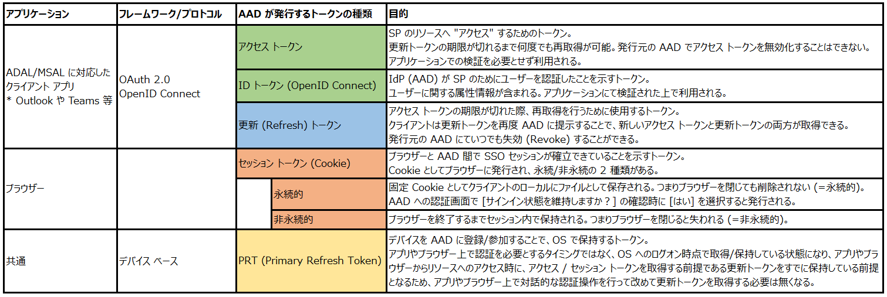

# Azure AD が発行するトークンの有効期間と考え方 (2023 年版)

> [!NOTE]
> 本記事は、2018 年公開の以下の Blog の内容が、現在の機能/技術にマッチしない内容になってきたことを踏まえ、2023 年現在の機能/技術を元に改めて考え方をおまとめしたものとなります。以前に公開した [Azure AD が発行するトークンの有効期間について (2018 年公開)](https://jpazureid.github.io/blog/azure-active-directory/aad-token-lifetime/) の記事は参考のためそのまま残し、新しく本記事を執筆しました。

こんにちは、Azure & Identity サポートの金森です。

Azure AD (AAD) は、Microsoft 365 をはじめ様々なクラウド サービスの認証基盤 (Identity Provider / IdP) として利用されています。その重要な機能としてユーザーの認証が完了したら、アプリケーションに対してトークンを発行するというものがあります。あるサービス (Teams や Exchange Online、他に Azure AD と連携しているクラウド上のサービス) にアプリがアクセスしようとした際、そのアプリはユーザーの認証を要求します。ユーザーが AAD 上で認証し、アクセス許可へ同意すると、AAD から "そのサービスにアクセスするための" トークンが発行され、アプリに渡されます。アプリはそのトークンをサービスに提示することでクラウド上のリソース (Teams や E メール、Microsoft Graph API など) にアクセスできるというイメージです。

弊社サポートでは、この [AAD が発行するトークン] にはどのような種類があるのか、構成によってトークンの有効期間はどうなっているのか、有効期間の制御は行えるのか等、様々なお問い合わせをいただきます。このため本記事ではそれらの詳細と考え方について、以下に紹介したいと思います。

## よく出てくるキーワード

解説に当たり、まず以下に略語の一覧をまとめます。これらのキーワードは、弊社へのお問い合わせの中でも頻繁に使用されるものであり、サポートからの回答でもよく利用されます。

| 略称 | 概要 |
| ------------------------- | ----------------------------------------------------------------------------------------------------------------------------------------- |
| AAD | Azure Active Directory の略です。|
| SSO | Single Sign On の略です。|
| IdP | Identity Provider の略です。以下の説明では AAD を指します。|
| SP | Service Provider の略です。以下の説明ではアクセス先のアプリケーションを指します。|
| ADAL/MSAL | 先進認証ライブラリの略です。OAuth 2.0 や OpenIDConnect のようなプロトコルを用いた認証方式を利用できるライブラリを指します。 |
| Confidential クライアント | サーバー上で動く Web アプリなどのように、ユーザーの手元では動作しないアプリを指します。|
| Public クライアント | JavaScript を使用してブラウザー上で動作するアプリや、スマホおよび PC 上のネイティブ アプリなどのように、ユーザーの手元のデバイス上で動作するアプリを指します。|
| PRT | [Primary Refresh Token](https://learn.microsoft.com/ja-jp/azure/active-directory/devices/concept-primary-refresh-token) の略です。|
| CA | [条件付きアクセス (Conditional Access)](https://learn.microsoft.com/ja-jp/azure/active-directory/conditional-access/overview) の略です。|
| CAE | [継続的アクセス評価 (Continuous Access Evaluation)](https://learn.microsoft.com/ja-jp/azure/active-directory/conditional-access/concept-continuous-access-evaluation) の略です。|
| SIF | [サインインの頻度 (Sign-in Frequency)](https://learn.microsoft.com/ja-jp/azure/active-directory/conditional-access/howto-conditional-access-session-lifetime#user-sign-in-frequency) の略です。|

## トークン種別 (プロトコルおよび目的)

様々なトークンの概要をまとめたものが以下です。使用するプロトコルやアクセス元のクライアントの種類、環境の構成によりさまざまな種類のトークンが使用されます。

## 既定のトークン有効期間

Azure AD が発行するトークンの有効期間をまとめたものが以下です。以下のうち SAML トークンは SAML 認証連携を使用した際に発行および利用されるものです。

各トークンの有効期間については、以下の公開情報もご覧ください。

- [アクセス トークンの有効期間](https://learn.microsoft.com/ja-jp/azure/active-directory/develop/access-tokens#access-token-lifetime)
- [ID トークンの有効期間](https://learn.microsoft.com/ja-jp/azure/active-directory/develop/id-tokens#id-token-lifetime)
- [更新トークンの有効期間](https://learn.microsoft.com/ja-jp/azure/active-directory/develop/refresh-tokens#refresh-token-lifetime)
- [プライマリ更新トークンとは](https://learn.microsoft.com/ja-jp/azure/active-directory/devices/concept-primary-refresh-token)

なお、特定のシナリオでは、上記の表に従わず例外的に特別な有効期間のトークンが発行されることもあります。

- シングル ページ アプリ (SPA) に対して発行される更新トークンは、[更新トークンの有効期間](https://learn.microsoft.com/ja-jp/azure/active-directory/develop/refresh-tokens#refresh-token-lifetime) のとおり 24 時間になります。
- AAD ユーザーに LastPasswordChangeTimestamp 属性が同期されていないフェデレーション認証のユーザーの場合、更新トークンおよびセッション トークンの有効期間は 12 時間になり、[頻繁にサインインすることを強制されます](https://learn.microsoft.com/ja-jp/troubleshoot/azure/active-directory/federated-users-forced-sign-in)。

## アクセス トークンの有効期間の考え方

### 継続的アクセス評価 (CAE: Continuous Access Evaluation) が提供される以前の考え方

AAD が発行するアクセス トークンは "ある SP のリソースにアクセスするためのトークン" であり、過去には 1 時間の有効期間でした。つまり、アクセス トークンを取得したアプリは、その有効期間である 1 時間の間は目的のリソースにアクセスし続けることが可能となります。一方でこれは、その 1 時間の間は AAD にアクセスしなくてよいという意味でもあり、AAD の機能である条件付きアクセス (CA) ポリシーが適用されないということも意味していました。

例えば、Outlook アプリが Exchange Online にアクセスするために、有効期間が 1 時間のアクセス トークンを保持しているとします。これは上述のとおり、Outlook は SP のリソース (Exchange Online) に対して 1 時間の間は継続的にアクセスが可能な状態を意味します。ここで一例ですが、"社内では Exchange Online のリソース (E メールやカレンダー) に自由にアクセス可能にし、外出した先 (カフェや空港のような) では、リソースへアクセスさせたくない" というシーンがあるとします。つまり、社内では Outlook によるメールの送受信は自由に行えるが、外出先のカフェでは送受信が行えないようにしたいというご要望があるという例です。このような例では、CA ポリシーで "Exchange Online に対して、すべての場所 (社内の IP は除く) からのアクセスをブロックする" というポリシーを構成し、AAD でアクセス制御を行う方針が一般的です。

ここで "AAD でアクセス制御を行う" というのは、つまりクライアント アプリ (Outlook) が AAD にアクセスしたタイミングで、AAD 側で CA ポリシーの評価および適用が行われるという意味でした。そのため、クライアント アプリ (Outlook) が AAD にアクセスしない限り、CA ポリシーの評価を受けるタイミングが無いことになります。このため、例えば 1 時間の有効期間のアクセス トークンを社内で取得し、それを保持したデバイスを持って外出し、カフェで最新のメールをチェックする (Outlook から Exchange Online にアクセスする) ということもそのままでは行えることになります。これは、1 時間利用可能なアクセス トークンを保持しているため、改めて (そのトークンの有効期間内に) AAD へのアクセスを Outlook が行うことが無いためです。

この "1 時間のアクセス トークン" の前提では、上記の "困った時間" も最長 1 時間ということになります。社内から外出したあと、最大 1 時間程度でアクセス トークンの有効期間が終了し、再度アクセス トークンを取得しようと AAD にアクセスしたタイミングで、CA ポリシーが評価されることが期待されました。上記の例で言うと、外出した後に、最大 1 時間程度で Outlook からの E メールの送受信がブロックできるようになることが期待される状態でした。

しかしながら、このようなアクセス トークンの有効期間による CA ポリシーの適用タイミングの "ずれ" は厳密にセキュリティを確保するうえで問題となります。

### CAE が有効化された後の考え方

CAE はまさに上記の例のような "困った時間" をできるだけ生じさせず、組織リソースへのアクセスをリアルタイムで評価およびブロックできるようにすることを実現する技術となります。そのロジックの詳細は前述の CAE の Blog や公開情報に説明がありますが、ポイントは **クライアントの利用環境が変化した際に SP 側でもリアルタイムにその環境変化を検知して、取得済みのアクセス トークンの有効期間に依存せず CA ポリシーの再評価タイミングを作る** という考え方になります。

例えば 1 時間の有効期間のアクセス トークンを社内で取得し、それを保持したデバイスを持ってカフェで最新のメールをチェック (Outlook から Exchange Online にアクセス) しようとした場合を考えます。この時、ユーザーが社外に移動したということを検知するには、アクセスを受けた Exchange Online 側での対応が必要です。CAE が有効になると、CA のポリシー情報やユーザー情報 (AAD で認証を受けたときの場所など) が SP (Exchange Online) 側にも共有されるようになります。これにより、Exchange Online 側ではユーザーの場所の移動を検知することが可能となり、アクセス トークンの残りの有効期限にかかわらず、ユーザーを AAD に誘導して CA ポリシーを再評価できるようになります。つまり、1 時間の有効期間による "困った時間" を極力減らすことができるようになるのです。

このリアルタイムな検知機能により、アクセス トークンの有効期間に基づいて頻繁に AAD にユーザーをアクセスさせる必要がなくなりますので、現在 CAE が有効 (既定で有効) な AAD テナントでは、アクセストークンの有効期間が最大で 28 時間 (Long lived) となっています。CAE が有効なテナントでアクセス トークンの有効期間が 28 時間に延長されたのはこのためです。従来は 1 時間毎であった CA ポリシーのチェックが、アクセス トークンの有効期間に関わらずリアルタイムに行え、よりセキュリティが高まったため、トークンの有効期間を延ばすようになったとお考えください。

[CAE (Continuous Access Evaluation: 継続的アクセス評価)](https://jpazureid.github.io/blog/azure-active-directory/cae-overview/index.html)

CAE が無効な場合、もしくは CAE は有効だが利用するリソースが CAE に対応していない場合は、アクセス トークンの有効期間は 60-90 分となり、以前の [1 時間のアクセス トークン] 利用時とほぼ同様の考え方になります。

## トークンの更新タイミングの考え方

### ADAL/MSAL (先進認証) クライアント利用時のトークン取得/更新の考え方

クライアントが更新トークンや PRT を保持している場合、アクセス トークンが必要になるとクライアントは AAD に (すでに保持済みの) 更新トークンおよび PRT を提示することで、再度新しいアクセス トークンを非対話的 (明示的な認証操作を必要とせず) に取得することが可能です。他の言い方をすると **更新トークンおよび PRT を保持していれば、アクセス トークンはいつでも必要なタイミングで非対話的に取得が可能** です。

ID トークンは OpenID Connect の流れにおいて、認証後に ID の属性情報をアプリに提示するためのトークンであり、初回のアプリへのアクセス時に参照された後は再利用されることが無いのが一般的です。そのため、上記の図では初回のアプリへのアクセスに伴う認証時のみ取得している表現としています。

一度更新トークンもしくは PRT を取得後に、改めて対話的な認証が必要となるケースは以下の通りです。

- 90 日間以上クライアント アプリを停止した状態を維持する (ほぼ 90 日以上 OS をシャットダウン or インターネット疎通できない状態にしているようなケース)
- 認証した AAD ユーザーのパスワードを変更する
- 対象ユーザーに発行済みの更新トークンを AAD 側で意図的に失効させる

### ブラウザーのトークン取得および更新の考え方

#### 非永続セッション (Cookie) の場合

改めて対話的な認証が必要となるケースは以下のとおりです。

- ブラウザーでリソースへのアクセスを行ってブラウザーを開いたまま 24 時間以上操作を行わない
- ブラウザーでリソースへのアクセスを行いブラウザーを開いたまま AAD ユーザーのパスワードを変更する
- ブラウザーを閉じる

> [!NOTE]
> PRT を取得済みのクライアントの場合もしくはブラウザーが PRT を利用できる場合は対話的な認証を必要とせずにアクセストークンおよびセッション トークンを取得可能です。ブラウザーが PRT を利用できるようにするためには、[サポートされているブラウザー](https://learn.microsoft.com/ja-jp/azure/active-directory/conditional-access/concept-conditional-access-conditions#supported-browsers) にてそれぞれ個別の構成が必要な場合があります。

#### 永続セッション (Cookie) の場合

改めて対話的な認証が必要となるケースは以下のとおりです。

- ブラウザーでリソースへのアクセスを行ってブラウザーを開いたまま 90 日以上操作を行わない
- ブラウザーでリソースへのアクセスを行いブラウザーを開いたまま AAD ユーザーのパスワードを変更する
- クライアント端末のローカルに保存されている Cookie のキャッシュをクリアする

## トークンの有効期間の制御

以前はトークンの有効期間を変更したい場合、PowerShell を用いてトークン ライフタイム ポリシーを AAD に構成する機能が提供されておりました。しかし、2021 年 1 月 30 日より、この "トークン ライフタイム ポリシーを用いた更新トークンとセッショントークンの有効期間を制御する機能" は廃止されています。詳細については [Token lifetime policies for refresh tokens and session tokens](https://learn.microsoft.com/ja-jp/azure/active-directory/develop/configurable-token-lifetimes) もご覧ください。

アクセス トークンに関しては、トークン ライフタイム ポリシーを用いた有効期間の制御が現状でも利用可能です。以前は、上述のように "1 時間のアクセス トークン" による "困った時間" を最小化するため、極力短い (10 分間) アクセス トークンの有効期間を設定したいというご要望もよくございました。しかし、CAE を用いた動的 (ポリシーの有効期間に依存しない) かつリアルタイムな CA ポリシーの評価が行える昨今では、アクセス トークンの有効期間を (主に短時間に) カスタムする運用は推奨されません。また、トークン ライフタイム ポリシーはプレビュー状態であり、運用環境への適用もお勧めできない状況です。

このため、アクセス トークンの有効期間をどうするかという観点というよりも、**CA ポリシーをリアルタイムに適用したいのであれば CAE を有効にする** こと、**対話的な認証を再度求められるタイミングを制御したいという要件の場合は CA ポリシーのサインインの頻度 (SIF) の機能を利用すること** をご検討ください。

サインインの頻度 (SIF) の機能については、[条件付きアクセスを使用して認証セッション管理を構成する](https://learn.microsoft.com/ja-jp/azure/active-directory/conditional-access/howto-conditional-access-session-lifetime#user-sign-in-frequency) をご覧ください。サインインの頻度は、CA のポリシーとして適用する機能となるため、適用対象のユーザー/アプリケーションの条件を柔軟に指定することが可能です。

## 終わりに

この数年で AAD は条件付きアクセスをはじめ、セキュリティと利便性のバランスを踏まえた、多様な制御機能の公開とアップデートが行われています。例えばここまでのご案内でご紹介した機能以外にも、リスクが高い認証 (漏洩したパスワードや普段とは違う場所や国からのアクセス) 時には、MFA を要求しパスワードの変更も強制するというアクセス制御を CA で行うことも可能です。前述の CAE もそうですが、このような "クライアントの動的な環境やリスクの変化を、可能な限りリアルタイムに検出してそのレベルに応じたアクセス制御を行う" ような考え方によって、よりご利用者様にとってもストレスが無い状態で高いセキュリティ環境を維持するアプローチがとれるようになってきています。

また、Windows Hello for Business のように、**高い強度の認証を突破した後は、ユーザーに極力再認証を求めないことで、パスワードそのものを利用者様が扱う機会を減らす** というアプローチも増えてきています。

**必ず 1 時間に 1 回の頻度で対話的な認証を行えば、確認の頻度が上がるからセキュリティが安心！という考え方は逆にセキュリティを低める** ことが報告されており、このような考え方からは大きく方向転換が必要かと思います。最新の仕組みを取り入れることで、セキュリティと利便性をトレードオフとすることなく、セキュリティを高めつつ利用者様への運用負担も減らすという "良いとこどり" が実現できるはずです。トークンの有効期間をベースとした静的なセキュリティから、ご利用者様の環境やリスクの変化を元にした動的なセキュリティの世界に進んでいくことを願ってやみません。

上記内容が皆様の参考となりますと幸いです。どちら様も素敵な AAD ライフをお過ごしください。
