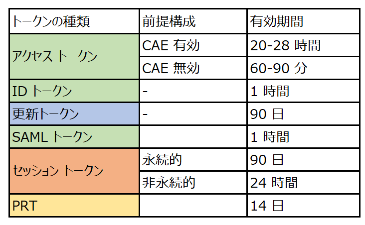
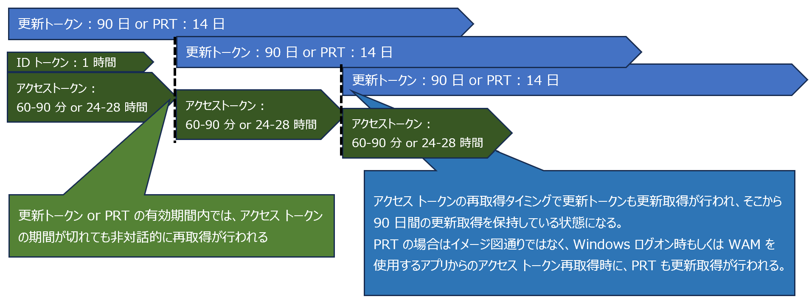

# Azure AD が発行するトークンの有効期間について (2023 年版)

> [!NOTE]
> 本記事は、2018 年公開の以下の Blog の内容が、現在の機能/技術にマッチしない内容になってきたことを踏まえ、2023 年現在の機能/技術を元に改めて考え方をおまとめしたものとなります。
>
> [Azure AD が発行するトークンの有効期間について (2018 年公開)](https://jpazureid.github.io/blog/azure-active-directory/aad-token-lifetime/)
> 

こんにちは、Azure & Identity サポートの金森です。

Azure AD (AAD) は、Microsoft 365 をはじめ様々なクラウド サービスの認証基盤 (Identity Provider / IdP) ですが、その重要な機能として認証が完了したユーザー アカウントに対してトークンを発行する、というものがあります。
あるサービス (Teams や Exchange Online、他連携しているクラウド サービス等) にクライアントがアクセスしようとした際、そのサービスが IdP として信頼している AAD から "そのサービスにアクセスするための" トークンを取得し、クライアントはそのトークンをサービスに提示することでアクセスできる、というイメージです。

この [AAD が発行するトークン] にはどのような種類があり、構成によってトークンの有効期間はどうなっているのか、有効期間の制御は行えるのか等について、以下に考え方をご紹介したいと思います。
以下は説明における略語の一覧です。

| 略称 | 概要 |
| ------------------------- | ----------------------------------------------------------------------------------------------------------------------------------------- |
| AAD | Azure Active Directory の略です。|
| SSO | Single Sign On の略です。|
| IdP | Identity Provider の略です。以下の説明では AAD を指します。|
| SP | Service Provider の略です。以下の説明ではアクセス先のアプリケーションを指します。|
| ADAL/MSAL | 先進認証ライブラリの略です。OAuth 2.0 や OpenIDConnect のようなプロトコルを用いた認証方式を利用できるライブラリを指します。 |
| Confidential クライアント | サーバー上で動く Web アプリなどのように、シークレットを秘密にできるクライアントを指します。|
| Public クライアント | JS アプリやスマホ上のネイティブ アプリなどのように、シークレットを安全に格納できないクライアントを指します。|
| PRT | [Primary Refresh Token](https://learn.microsoft.com/ja-jp/azure/active-directory/devices/concept-primary-refresh-token) の略です。|
| CA | [条件付きアクセス (Conditional Access)](https://learn.microsoft.com/ja-jp/azure/active-directory/conditional-access/overview) の略です。|
| CAE | [継続的アクセス評価 (Continuous Access Evaluation)](https://learn.microsoft.com/ja-jp/azure/active-directory/conditional-access/concept-continuous-access-evaluation) の略です。|
| SIF | [サインインの頻度 (Sign-in Frequency)](https://learn.microsoft.com/ja-jp/azure/active-directory/conditional-access/howto-conditional-access-session-lifetime#user-sign-in-frequency) の略です。|

## トークン種別 (プロトコル、目的別)

## 既定のトークン有効期間

以下は参考情報です。

[アクセス トークンの有効期間](https://learn.microsoft.com/ja-jp/azure/active-directory/develop/access-tokens#access-token-lifetime)
[ID トークンの有効期間](https://learn.microsoft.com/ja-jp/azure/active-directory/develop/id-tokens#id-token-lifetime)
[更新トークンの有効期間](https://learn.microsoft.com/ja-jp/azure/active-directory/develop/refresh-tokens#refresh-token-lifetime)
[プライマリ更新トークンとは](https://learn.microsoft.com/ja-jp/azure/active-directory/devices/concept-primary-refresh-token)

> [!NOTE]
> 以下のような例外シナリオもあります。
>  
> シングル ページ アプリ (SPA) リソースへのアクセス時に取得する更新トークンは 24 時間になります。
> [更新トークンの有効期間](https://learn.microsoft.com/ja-jp/azure/active-directory/develop/refresh-tokens#refresh-token-lifetime) 
>  
> AAD ユーザーに LastPasswordChangeTimestamp 属性が同期されていないフェデレーション認証のユーザーの場合、更新 / セッション トークンの有効期間は 12 時間になります。
> [Azure AD のフェデレーション ユーザーは、頻繁にサインインすることを強制されます](https://learn.microsoft.com/ja-jp/troubleshoot/azure/active-directory/federated-users-forced-sign-in)

## アクセス トークンの有効期間の考え方

アクセス トークンは [ある SP のリソースにアクセスするためのトークン] となり、過去には 1 時間の有効期間でした。
現在の AAD では、CAE と呼ばれる機能が既定で有効になっており、24 時間以上の Long Aged なトークンとなっています。

CAE に関しては以下もご参照ください。
[CAE (Continuous Access Evaluation: 継続的アクセス評価)](https://jpazureid.github.io/blog/azure-active-directory/cae-overview/index.html)

これは一例ですが、ご利用シナリオにおけるセキュリティ ニーズとして、例えば [社内では Outlook や Teams で組織のリソース (情報) に自由にアクセス可能、しかし外出した先 (カフェや空港のような) では、組織のリソースへのアクセスをさせたくない] というシーンがあるとします。
つまり、社内では Outlook によるメールの送受信は自由に行えるが、外出先のカフェでは送受信が行えないようにしたい、というご要望がある、という例です。
このような例では、CA で [社内の IP 以外の場所からのアクセスをブロックする] というポリシーを構成し、AAD でアクセス制御を行う方針が一般的です。
"AAD でアクセス制御を行う"、つまりクライアント (Outlook) が AAD にアクセス制御の評価を受けるようなアクセスを行ったタイミングで、CA ポリシーの評価が行われます。
そのため、逆に言えばクライアント (Outlook) が AAD にアクセスしない限り、CA ポリシーの評価を受けるタイミングが無いことになります。

一方、クライアントは有効期間内のアクセス トークンを保持している間は、該当の SP のリソースにアクセスすることが可能です。
つまり、クライアントは (上記例では Exchange Online に対する) アクセス トークンを保持している場合、SP のリソース (Exchange Online) に対してアクセスすることが可能な状態を維持します。
そのため、例えば 28 時間の Exchange Online へのアクセス トークンを社内で取得/保持した端末を持って外出し、カフェで最新のメールをチェックする、ということもそのままでは行えることになります。
これは、利用可能なアクセス トークンを保持しているため、改めて (そのトークンの有効期間内に) AAD へのアクセスを Outlook が行うことが無いためです。
組織としては [社外では組織のリソース (Outlook から Exchange Online) にアクセスさせたくない] というご要望があるが、Outlook は保持しているアクセス トークンの有効期間内 (最大 28 時間) であればリソースにアクセスできることになり、これは困った、ということになります。

過去の [1 時間のアクセス トークン] の前提では、上記の [困った時間] も最長 1 時間、ということになります。
つまり、社内から外出した場合は最大 1 時間程度でアクセス トークンの有効期間が終了し、再度アクセス トークンを取得するための [AAD へのアクセス (=CA ポリシーの評価タイミング)] が行われることが期待されました。
上記の例で言うと、1 時間程度で Outlook からのメールの送受信がブロックできるようになることが期待される状態でした。

では **CAE が有効な状態では、アクセス トークンは最大 28 時間なので、[困った時間] も最長 28 時間になるのか？** という懸念が生じるかと思います。
大丈夫です。CAE はまさに上記の例のような [困った時間] をできるだけ生じさせず、組織としてアクセスさせたくない環境にあるクライアントから、組織リソースへのアクセスをリアルタイムでブロックできるようにすることを目指す技術となります。
そのロジックの詳細は前述の CAE の Blog や公開情報に説明がありますが、ポイントは [クライアントの利用環境が変化した際、取得済みのアクセス トークンの有効期間に依存せず、リアルタイムにその環境変化を検知して、CA ポリシーの再評価タイミングを作る] という考え方になります。
そのため、CAE が有効な場合は、アクセス トークンの有効期間が Long Aged であっても、セキュリティのリスクはカバーできることになります。

CAE が無効な場合、もしくは CAE は有効だが利用するアプリケーション / リソースが CAE に対応していない場合は、アクセス トークンの有効期間は 60-90 分となり、以前の [1 時間のアクセス トークン] 利用時とほぼ同様の考え方になります。

## トークンの更新タイミングの考え方

### ADAL / MSAL (先進認証) クライアント利用時のトークン取得/更新の考え方

クライアントが更新トークンや PRT を保持している場合、アクセス トークンが必要になるとクライアントは AAD に (すでに保持済みの) 更新トークン / PRT を提示することで、再度新しいアクセス トークンを非対話的 (明示的な認証操作を必要とせず) に取得することが可能です。
他の言い方をすると [更新トークン / PRT を保持していれば、アクセス トークンはいつでも必要なタイミングで非対話的に取得が可能] です。

ID トークンは OpenIDConnect での認証時に ID の属性情報を提示するためのトークンであり、初回の SP リソースへのアクセス時に提示された後は再利用されることが無いのが一般的です。
そのため、上記の図では初回の SP へのアクセスに伴う認証時のみ取得している表現となっています。
一度更新トークン or PRT を取得後に、改めて対話的な認証が必要となるケースは以下の通りです。

- 90 日間以上、クライアント アプリを停止した状態を維持する (ほぼ 90 日以上 OS をシャットダウン or インターネット疎通できない状態にしているようなケース)
- 認証した AAD ユーザーのパスワードを変更する
- AAD 側で対象ユーザーに発行済みの更新トークンを操作により失効する

### ブラウザーのトークン取得/更新の考え方

#### 非永続セッション (Cookie) の場合

改めて対話的な認証が必要となるケースは以下の通りです。

- ブラウザーでリソースへのアクセスを行ってブラウザーを開いたまま 24 時間以上セッション上での操作を行わない
- ブラウザーでリソースへのアクセスを行いブラウザーを開いたまま AAD ユーザーのパスワードを変更する
- ブラウザーを閉じる

> [!NOTE]
> PRT 取得済みのクライアントの場合、且つブラウザーが PRT を利用できる場合は対話的な認証を必要とせずにセッション トークンの取得が可能です。
> ブラウザーが PRT を利用できるようにするためには、そのブラウザー毎の対応可否と必要な構成があり、以下の技術情報をご参照ください。
> [サポートされているブラウザー](https://learn.microsoft.com/ja-jp/azure/active-directory/conditional-access/concept-conditional-access-conditions#supported-browsers)
> 

#### 永続セッション (Cookie) の場合

改めて対話的な認証が必要となるケースは以下の通りです。

- ブラウザーでリソースへのアクセスを行ってブラウザーを開いたまま 90 日以上セッション上での操作を行わない
- ブラウザーでリソースへのアクセスを行いブラウザーを開いたまま AAD ユーザーのパスワードを変更する
- クライアント端末のローカルに保存されている Cookie のキャッシュをクリアする

## トークンの有効期間の制御

以前はトークンの有効期間は、PowerShell を用いたトークン ライフタイム ポリシーを AAD に構成することで制御を行う機能が提供されておりました。
しかし、2021 年 1 月 30 日より、この [トークン ライフタイム ポリシーを用いた更新トークンとセッショントークンの有効期間を制御する] 機能は廃止されています。
[Token lifetime policies for refresh tokens and session tokens](https://learn.microsoft.com/ja-jp/azure/active-directory/develop/configurable-token-lifetimes)

アクセス トークンに関しては、トークン ライフタイム ポリシーを用いた有効期間の制御が現状でもご利用可能ですが、本ポリシー自体が Preview であり、CAE を用いた動的な (ポリシーの有効期間に依存しない) 環境変更に伴うリアルタイムな CA ポリシーの評価を行うデザインへの移行が進められる昨今では、アクセス トークンの有効期間を (主に短時間に) カスタムする運用は推奨されません。

アクセス トークンの有効期間をどうするか、という観点というよりは、おそらく元々の目的であった [対話的な認証を再度求められるタイミングを制御したい] というご要件がある場合は、CA ポリシーの **サインインの頻度** 機能のご利用をご検討ください。
[条件付きアクセスを使用して認証セッション管理を構成する](https://learn.microsoft.com/ja-jp/azure/active-directory/conditional-access/howto-conditional-access-session-lifetime#user-sign-in-frequency)

サインインの頻度は、CA のポリシーとして適用する機能となるため、適用対象のユーザー/アプリケーションの条件を柔軟に指定することが可能です。

## 終わりに

いかがでしたでしょうか。
この数年で AAD は条件付きアクセスをはじめ、セキュリティと利便性のバランスを踏まえた、多様な制御機能の公開とアップデートを行っております。
例えばここまでのご案内でご紹介した機能以外にも、リスクが高い (と Identity Protection の評価で判定される) 認証時には、パスワードの変更と MFA を突破する必要がある、というアクセス制御を CA で行うことも可能です。
前述の CAE もそうですが、このような [クライアントの動的な環境やリスクの変化を、可能な限りリアルタイムに検出してそのレベルに応じたアクセス制御を行う] ような考え方によって、よりご利用者様にとってもストレスが無い状態で高いセキュリティ環境を維持するアプローチがとれるようになってきています。
また、Windows Hello for Business のような "高セキュリティな認証を突破した後は、利用者にとってシンプルなサインイン操作を行い、気密性が高い Credential (パスワード) そのものをご利用者様が扱う機会を減らす" というアプローチの選択肢も増えてきています。

[必ず 1 時間に 1 回の頻度で対話的な認証を行えば、本人確認の頻度が上がるからセキュリティが安心！] という考え方からはとてもダイナミックなアップデートかと思います。
しかし、セキュリティと利便性はトレードオフの関係であり、セキュリティも高めたいけどご利用者様への運用負担も増やしたくない、という "良いとこどり" にも近づいているのではないでしょうか。
トークンの有効期間をベースとした静的なセキュリティから、ご利用者様の環境やリスクの変化を元にした動的なセキュリティの世界に進んでいくことを願ってやみません。

上記内容が皆様の参考となりますと幸いです。どちら様も素敵な AAD ライフをお過ごしください。
