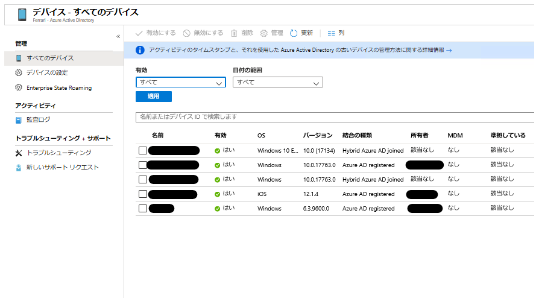
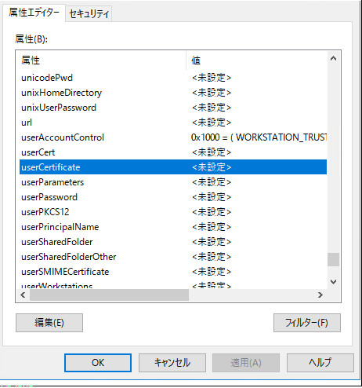
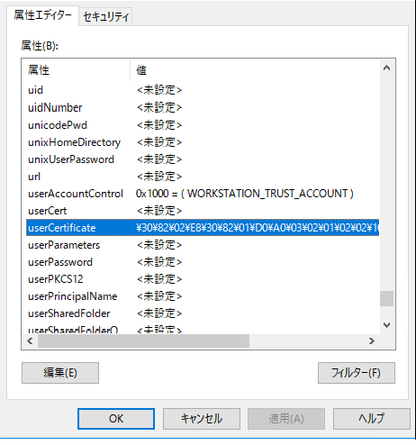

# Hybrid Azure AD Join 失敗時の初動調査方法について (マネージド編)

こんにちは、Azure & Identity サポート チームの 姚 (ヨウ) です。

多くの方にご利用いただいている Hybrid Azure AD Join (以後 HAADJ) の構成ですが、構成に失敗する場合、 Azure AD の観点だけでなく、オンプレミス Active Directory と Windows の観点での確認が必要です。
今回は、HAADJ の構成時の初動調査について紹介します。

今回の情報により問題が解決すれば越したことはありませんが、問題が解決しない場合も、ここで確認した初期切り分け情報を含めることで、サポートにスムーズな形で調査を依頼することができます。

なお、 HAADJ には、マネージド構成とフェデレーション構成の 2 種類の構成があります。
HAADJ とマネージド構成とフェデレーション構成については、それぞれ以下の弊社公開情報をご参照ください。

Select your scenario based on your identity infrastructure
https://docs.microsoft.com/en-us/azure/active-directory/devices/hybrid-azuread-join-plan#select-your-scenario-based-on-your-identity-infrastructure

今回は、まずマネージド構成、 Azure AD Conenct のみを利用する HAADJ 構成の初動調査について、構成に失敗する際の代表的な症状 3 つに対する初動調査を紹介します。
フェデレーション構成については第二弾として近いうちに公開したいと思います。

## (1) オンプレミスのコンピューターが Azure AD のデバイス一覧に存在しない

HAADJ を構成することでオンプレミスのドメインに所属するコンピューターを示すデバイス オブジェクトが Azure AD Connect により Azure AD に同期されます。
HAADJ が正常にできているかの最初の確認としては、 Azure ポータルを開き [Azure Active Directory] ブレードの [デバイス] 欄で結合の種類が Hybrid Azure AD Joined となっている状態で対象のコンピューターが存在するか確認します。



対象のデバイスが [Azure Active Directory] ブレードの [デバイス] 欄に存在しない場合、デバイスが Azure AD Connect によって同期されていない可能性が高く、真っ先に確認いただきたいのはオンプレミス Active Directory にある
当該コンピューター オブジェクトに userCertificate に何らかの値が書き込まれていないかどうかです。
Azure AD Connect はコンピューター オブジェクトの userCertificate 属性に何らかの値が書き込まれている場合に、コンピューター オブジェクトを Azure AD に同期します。

その確認方法は、任意のドメイン コントローラーで ADSI エディター ([ファイル名を指定して実行] や検索ボックスから adsiedit.msc) を起動し、対象のコンピューター オブジェクトのプロパティを開きます。
以下は userCertificate に値が書き込まれていない場合の例で、この場合、一般的に以下の要因によって発生しますので、それぞれ順番に確認を行います。



### (1-1) HAADJ の処理で、デバイスを Azure AD Join するタスクが有効になっていない

HAADJ の Join 処理はクライアント端末の以下のタスクによって実施されます。このタスクが実行されないと Azure AD Connect による同期対象にクライアント コンピューターがなりません。

パス : [タスクスケジューラ] – [タスクスケジューラ ライブラリ] – [Microsoft] – [Windows] – [Workplace Join]
タスク名 : Automatic-Device-Join

タスクはオンプレミスの Active Directory に参加するタイミングで有効になりますので、ドメイン参加後にこのタスクが有効かどうかを確認ください。
もし、オンプレミス Active Directory に参加したにも関わらず、当該タスクが有効ではない場合、この時点でサポートにお問い合わせをご検討ください。

当該タスクが有効の場合、次の (1-2) の確認事項に進みます。

### (1-2) Service Connection Point (SCP) が正常に構成されていない

SCP はクライアント端末が HAADJ Join する先の Azure AD テナントの情報が書き込まれています。

(1-1) のクライアント上で実行されるタスクは SCP を元に Azure AD へのエンドポイントを確認し、コンピューター オブジェクトの userCertificate 属性に必要な情報を書き込みます。
SCP が正常に構成されていない場合、userCertificate 属性は書き込まれず、コンピューター オブジェクトが同期されない結果になるため、 SCP が正しく設定されているか確認します。

SCP は、オンプレミス Active Directory の構成パーティションか、クライアント端末のレジストリ キー値のいずれかで設定ができます。
以下の手順で SCP が設定されているかどうかを確認します。

Active Directory の構成パーティション、またはクライアント端末のレジストリ キー値のいずれか設定されていれば問題はありません。
もし、SCP の設定に問題はなければ、次の (1-3) の確認事項に進みます。

#### Active Directory の構成パーティションの確認

(1) ドメイン コントローラーに管理者ユーザーのログオンし、管理者で PowerShell を起動します。
(2)  以下のコマンドを実行します。

```powershell
$scp = New-Object System.DirectoryServices.DirectoryEntry
$scp.Path = "LDAP://CN=62a0ff2e-97b9-4513-943f-0d221bd30080,CN=Device Registration Configuration,CN=Services,CN=Configuration,DC=xxxxxxx,DC=xxxxxx"
$scp.Keywords
```

  DC=xxxxxxx,DC=xxxxxx にはオンプレミス Active Directory のドメイン名 (フォレストに複数ドメインが存在する場合には、フォレスト ルート ドメイン名) を入力します。
  contoso.com の場合、DC=contoso,DC=com  と入力します。

```powershell
例 :

$scp = New-Object System.DirectoryServices.DirectoryEntry
$scp.Path = "LDAP://CN=62a0ff2e-97b9-4513-943f-0d221bd30080,CN=Device Registration Configuration,CN=Services,CN=Configuration,DC=contoso,DC=com "
$scp.Keywords
```

  これらのコマンドの出力結果として、以下のように Azure AD テナントのドメイン名 (azureADName) とテナント ID (azureADId) の情報が表示されていれば、正常に構成されていると判断できます。
  また、マネージドの HAADJ であるため、azureADName は xxxxx.onmicrosoft.com 形式で設定されている必要があります。

```
azureADName:<Azure AD テナントドメイン名の xxxxx.onmicrosoft.com 形式>
azureADId:<Azure AD テナント ID>

例 :
azureADName:microsoft.onmicrosoft.com
azureADId:72f988bf-86f1-41af-91ab-2d7cd011db47
```

#### クライアント端末のレジストリ キー値の確認

クライアント端末の以下の 2 つのレジストリー値に Azure AD テナントの情報が設定しているかどうかを確認します。

- レジストリー キー : KEY_LOCAL_MACHINE\SOFTWARE\Microsoft\Windows\CurrentVersion\CDJ\AAD
  - 値 : TenantId
  - 種類 : REG_SZ
  - 値 : TenantName
  - 種類 : REG_SZ

TenantName には Azure AD のテナント ドメイン名 (xxxx.onmicrosoft.com 形式) と TenantId には Azure AD テナント ID の両方が設定されている必要があります。
SCP として、いずれかの場所に正常に設定されていることが確認できましたら、次の (1-3) にお進みください。

### (1-3) HAADJ に必要な Azure AD のエンドポイントへアクセスできていない


クライアント上で実行される HAADJ のタスクは userCertificate 属性を書き込む前に SCP に指定されている Azure AD テナントが実際に存在するか確認します。
具体的には HAADJ に必要な以下の Azure AD のエンドポイントへのアクセスを試行し、ここにアクセスして指定された Azure AD テナントの存在を確認した上で userCertificate へ情報を書き込みます。

```
https://enterpriseregistration.windows.net
https://login.microsoftonline.com
https://device.login.microsoftonline.com
```

インターネットへの接続にプロキシー サーバーを経由する必要がある環境の場合、クライアント端末の WinHTTP のプロキシー サーバー設定にプロキシー サーバーを設定する必要があります。これは HAADJ のタスクがシステム コンテキストで動作し、 winHTTP の設定を利用するためです。HAADJ のタスクは認証を必要とするプロキシー サーバーには対応していませんので、認証を必要とするようにプロキシ サーバーが構成されている場合、認証を解除する必要があります。

クライアント端末で管理者権限でコマンド プロンプトを起動し、以下のコマンドを実行し、WinHTTP のプロキシ サーバーが設定されているか確認します。

```cmd
netsh winhttp show proxy
```

プロキシを利用してアクセスすることが必要な環境であるのにも関わらず、設定されていない場合、以下のコマンドを実行し、設定します。

```cmd
netsh winhttp set proxy proxy-server="<プロキシー サーバー>:<ポート>" bypass-list="<バイパスする URL>"
```

- <バイパスする URL> はプロキシ サーバーを介さずにアクセスさせるサーバーの一覧です。必要に応じて指定します。
例えばローカルと *.test.com へのアクセスにはプロキシを経由させない場合には、 bypass-list="<local>;*.test.com" というような記載を行います。

WinHTTP のプロキシー サーバー設定を実施した場合には、以下のタスクを手動で実行します。

パス : [タスクスケジューラ] – [タスクスケジューラ ライブラリ] – [Microsoft] – [Windows] – [Workplace Join]
タスク名 : Automatic-Device-Join

再度、ドメイン コントローラーで ADSI エディターを利用し、対象のコンピューター オブジェクトの userCertificate に何らかの値が書き込まれたかどうかを確認ください。
以下の例は userCertificate に何らかの値が書き込まれた場合です。



以上を確認した結果として、特に問題が無い場合には、これまで確認された情報を合わせ、サポートにお問い合わせすることをご検討ください。

## (2) HAADJ の対象のコンピューター オブジェクトが、保留中の状態


HAADJ の対象のコンピューター オブジェクトが Azure AD に登録されているが、Azure ポータルで以下の図の例のように [登録済み] の欄が "保留中" というステータスになっている場合には HAADJ が完了していない状態を疑います。


Azure AD Connect によりコンピューターオブジェクトが、 Azure AD に同期され、その後、クライアントで再度 Automatic-Device-Join タスクが実行されることにより、デバイスの Azure AD への登録 (Hybrid Azure AD Join の処理) が完了します。
コンピューター オブジェクトは同期されたものの、最終的な Join 処理が失敗、あるいはタスクが未実行の場合、Azure ポータルではデバイスは上記のように "保留中" という状態になります。

コンピューター オブジェクトが Azure AD に同期された後に、ユーザーがログオフ/ログオンを実行していない場合タスクはまだ未実行であるため、処理が完了していないのは想定される動作です。
そのため、一度ユーザーのログオフ、ログオンにより状態が変わるかをご確認ください。
ログオンすることによって、バックグラウンドで Automatic-Device-Join タスクが実行され、最終的な Join 処理が実施されることが期待できるためです。

もし、ユーザーによるログオフ/ログオンを実施しても、"保留中" の状態が変わらない場合、以下の Azure AD 側のエンドポイントにアクセスできないことが原因として考えられます。

```
https://enterpriseregistration.windows.net
https://login.microsoftonline.com
https://device.login.microsoftonline.com
```

このため、"(1-3) HAADJ に必要な Azure AD のエンドポイントへアクセスできていない" の項を参照の上、 winHTTP プロキシの設定が行われているか確認ください。

以上を実施しても、デバイスの状態が "保留中" から変わらない場合、詳細調査が必要ですので、これまで確認された情報と合わせサポートにお問い合わせをすることをご検討ください。

## (3) HAADJ によるシングル サインオンができない (HAADJ が動作していない)

HAADJ ができたコンピューターにログオンすることにより、ログオンしたユーザーはプライマリー リフレッシュ トークン (以後 PRT) を取得できます。PRT は HAADJ に通常利用する同期ユーザーがクライアント端末にログオンする際に Azure AD へのユーザー認証に成功し、認証に成功したことを示すキャッシュ情報です。
PRT の詳細については、以下の弊社技術情報をご参照ください。

プライマリ更新トークンとは
https://docs.microsoft.com/ja-jp/azure/active-directory/devices/concept-primary-refresh-token

この PRT を正常に取得できない場合、以下のような事象が発生します。

- Intune の自動登録に失敗する
- 条件付きアクセス ポリシーで "ハイブリッド Azure AD 参加済みデバイス" のコントールで拒否される
- Hybrid Azure AD Join の端末からクラウド リソースへ SSO できない

PRT を正常に取得できているか (HAADJ が正しく完了しているか) は以下の確認事項をもとに判断できます。

### (3-1)  本ブログにある (1) および (2) の事象が発生していないこと

### (3-2)  Azure AD にも同期されているオンプレミスの Active Directory のユーザーで端末にログオンします。
コマンド プロンプトを起動し、dsregcmd /status コマンドを実行します。
dsregcmd コマンドにはほかにもたくさんの出力の情報がありますが、まずは以下の項目をご確認ください。

```
AzureAdJoined : YES <<<<<<<<<<<< AzureAdJoined は YES になっており、Azure AD に正常に Join していると判断できます
DomainJoined : YES <<<<<<<<<<<< DomainJoined は YES になっており、正常にオンプレミスの Active Directory に参加していると判断できます
AzureAdPrt : NO <<<<<<<<<<<< AzureAdPrt は NO になっている場合、PRT を正常に取得できていないと判断できます
```

PRT を正常に取得できない場合の一般的な要因はユーザーのログオンタイミングで以下の Azure AD 側のエンドポイントにアクセスできないことが考えられます。
まずは、"(1-3) HAADJ に必要な Azure AD のエンドポイントへアクセスできていない" の対応をご参照ください。

```
https://enterpriseregistration.windows.net
https://login.microsoftonline.com
https://device.login.microsoftonline.com
```

この結果、問題無い場合には、詳細調査が必要ですので、以下の事項と合わせましてサポートにお問い合わせをご検討ください。

- 事象は複数のユーザーで発生しているか、または特定のユーザーにのみ発生しているか

- 事象は特定のクライアント端末で発生しているかどうか
正常に PRT を取得できるユーザーがいる場合、PRT を取得できないユーザーがログオンしている端末で取得できるかどうか

- PRT は HAADJ を構成してから一度も正常に取得できていないかどうか

以上、HAADJ のマネージド構成のトラブシューティングの参考になりましたら幸いです。

製品動作に関する正式な見解や回答については、お客様環境などを十分に把握したうえでサポート部門より提供させていただきますので、ぜひ弊社サポート サービスをご利用ください。

