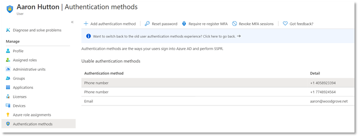
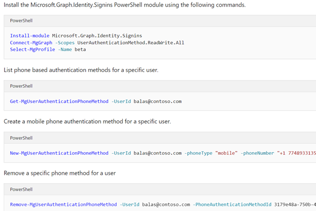
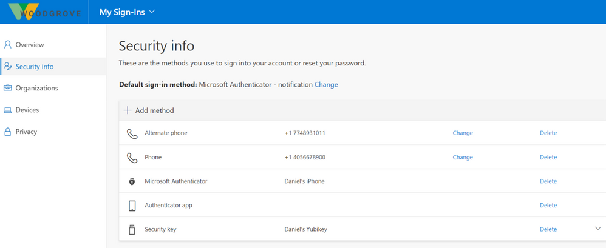

# Azure AD Connect をご利用のお客様に対して予定されている多要素認証に関する変更

皆さんこんにちは。Azure & Identity サポート チームの高田です。

本日は Azure AD Connect を利用しオンプレミス AD から Azure AD にユーザーを同期しているお客様において影響が生じる可能性のある多要素認証の動作変更についてお知らせいたします。この内容は、[Azure Active Directory Identity Blog](https://techcommunity.microsoft.com/t5/azure-active-directory-identity/upcoming-changes-to-managing-mfa-methods-for-hybrid-customers/ba-p/1994722) で公開されたものであり、本記事ではその内容についてより分かりやすく解説いたします。

## 影響を受ける可能性のあるお客様

本記事で解説する内容で影響を受ける可能性があるのは、以下のすべての点に該当するお客様です。

- オンプレミス AD 上のユーザー属性に多要素認証用の電話番号を設定している。
- Azure AD Connect などのアカウント同期ソリューションを利用してオンプレミス AD から Azure AD にユーザーを同期している。
- 管理者が PowerShell を用いて電話で多要素認証を行うようユーザー属性 (StrongAuthenticationMethods 属性) を変更をしている。

上記のような状態は、ユーザーの多要素認証設定を管理者が行う場合に相当します。つまり、管理者は PowerShell を用いて多要素認証の方法 (電話番号を用いた認証）を指定し、認証に使用する電話番号はオンプレミス AD の属性から設定するという方法です。この方法をとると、ユーザーが自身で多要素認証をセットアップせずとても、管理者から多要素認証 (電話番号を用いた認証) を構成できます。

なお、Azure AD Connect などアカウント同期ソリューションを利用して電話番号を Azure AD に同期していても、管理者が各ユーザーに対して電話認証の利用を設定してない場合は本記事の影響を受けません。ただし、多要素認証用の電話番号について正しい運用方法を確認するため、いずれのお客様でも後述します対応内容をご覧いただくことをお勧めします。

## 変更前の動作

現在 Azure AD ユーザーは以下の 2 種類の電話番号を利用しています。

- パブリックな電話番号: ユーザーのプロファイルの一部として管理されている連絡先電話番号
- 認証用の電話番号: 他のユーザー (管理者を除く) からは参照できない認証専用の電話番号

前述のとおり、本変更の影響を受ける可能性のあるお客様では、オンプレミス AD 上のユーザーが電話番号を保持しており、この電話番号が Azure AD Connect を利用することで Azure AD 上のユーザーにも同期される状態となります。このようにして同期された電話番号は、パブリックな電話番号として Azure AD 上に設定されます。つまり、Azure ポータルや Outlook のアドレス帳などから確認可能な電話番号として表示されます。

一方、認証用の電話番号は、ユーザーが多要素認証のセットアップを使用するか、管理者が認証方法のブレードなどを使用することで設定されます。これらの操作を明示的に行わない限りは、認証用の電話番号はユーザーに未設定の状態です。

現在の動作では、このようにして同期されたユーザーがパブリックな電話番号のみを持ち、さらに認証用の電話番号を保持していない状態で管理者が PowerShell から電話認証の利用を有効化した場合、条件付きアクセスで多要素認証が要求されると、ユーザーに設定されているパブリックな電話番号に電話認証が試行されます。つまり、Azure AD はユーザーの認証用の電話番号が未設定の場合は、代わりにパブリックな電話番号を使用して多要素認証を試行します。

| パブリックな電話番号 | 認証用の電話番号 |
| ---------------------- | ----------------|
| 携帯電話: +81 123456789 | 電話番号: (未設定) |
| | 認証方法 (StrongAuthenticationMethods): 電話認証 |

例えば、ユーザーが上記のような属性を持つ状態の場合、認証用の電話番号には多要素認証の方法として電話認証の設定のみが行われており、多要素認証に使用する電話番号は設定されていません。しかしこの場合でも現状の動作では、ユーザーに多要素認証が求められるとパブリックな電話番号 (+81 123456789) が代わりに多要素認証に使用され、+81 123456789 に SMS などが送信されます。

## 予定されている動作変更の内容

マイクロソフトでは、継続してユーザービリティとセキュリティに対する改善を進めており、その一環として Azure AD が保持する電話番号の扱いについてよりシンプルなモデルを採用することを検討しています。

今回予定されているのは、上記のようにパブリックな電話番号と認証方法 (電話認証) の設定を持つ一方で認証用の電話番号が未設定の同期ユーザーに対し、オンプレミス AD から同期されたパブリックな電話番号を認証用の電話番号にコピーするという対応です。また、パブリックな電話番号が認証用の電話番号にコピーされ認証用の電話番号が構成されると、Azure AD はそれ以降、認証用の電話番号に多要素認証を試行するように動作が変化します。つまり、パブリックな電話番号が代わりに多要素認証に使用されるという動作はなくなります。

| パブリックな電話番号 | 認証用の電話番号 |
| ---------------------- | ----------------|
| 携帯電話: +81 123456789 | 電話番号: +81 123456789 (パブリックな電話番号からコピー) |
| | 認証方法 (StrongAuthenticationMethods): 電話認証 |

マイクロソフトでは、このように多要素認証には認証用の電話番号のみを使用する用動作を変更します。これに際し、上記条件に合致するお客様に影響が生じないようこのコピー処理を 5 月 1 日まで順次各テナントで実施します。ただし、コピー処理がいつどのタイミングで行われるかはデータセンター側での対応となり事前に確認することはできません。このためお客様におかれましては上記の変更についてご理解の上、速やかに後述する対応 (運用方法の変更) を実施くださいますようお願い申し上げます。

## 動作変更に伴い必要となる対応

以上の動作変更に伴い、多要素認証に使用する電話番号を現在オンプレミス AD 上で管理されているお客様においては、管理方法を変更いただく必要がございます。多要素認証に使用する電話番号を変更したい場合は、管理者がオンプレミス AD 上のユーザー属性 (電話番号) を変更するという方法ではなく、後述するいずれかの方法で認証用の電話番号を設定および更新するようご対応ください。

### Azure ポータルからユーザーの「認証方法」ブレードを使用する

管理者がユーザーの認証用電話番号を構成したい場合、Azure ポータルの Azure Active Directory ブレードから行うのが簡単です。Azure Active Directory ブレードより対象のユーザーを選択し、認証方法のブレードへお進みください。[この方法](https://docs.microsoft.com/ja-jp/azure/active-directory/authentication/howto-mfa-userdevicesettings#add-authentication-methods-for-a-user) によりポータルの画面からユーザーの認証用電話番号を直接変更いただけます。

### Microsoft Graph API の authentication/methods エンドポイントを使用する

管理者がユーザーの認証用電話番号を構成する方法としては、直接 [Microsoft Graph API の authentication/methods エンドポイント](https://docs.microsoft.com/ja-jp/graph/authenticationmethods-get-started) を使用する方法もございます。API を直接操作したい場合は本方法をご利用ください。

### Microsoft.Graph.Identity.Signins PowerShell を使用する

Microsoft Graph API を直接操作することが難しい場合は、[Microsoft.Graph.Identity.Signins PowerShell コマンド](https://docs.microsoft.com/ja-jp/azure/active-directory/authentication/howto-mfa-userdevicesettings#manage-methods-using-powershell) から同様の操作を実施いただけます。

### ユーザーが自ら MyAccount ページから設定する

エンドユーザーが自ら認証用電話番号を構成することも可能です。この場合は、ユーザー自ら [MyAccount](http://myaccount.microsoft.com/) にアクセスし、セキュリティ情報のタブから認証用電話番号を追加ください。

