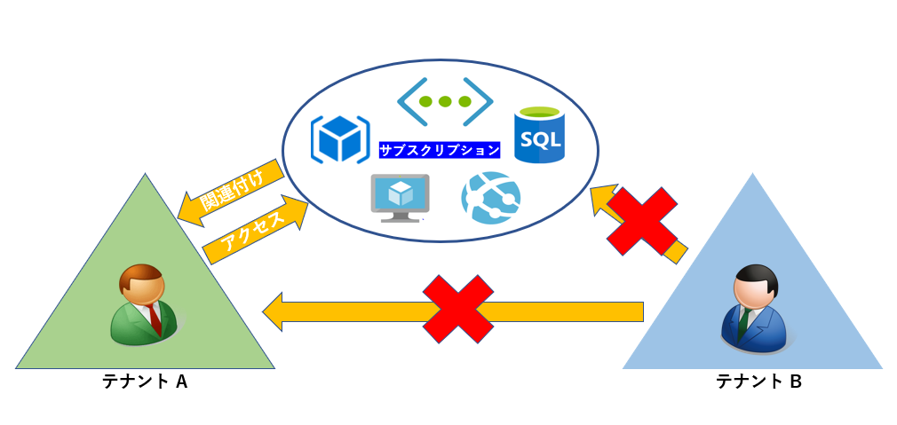
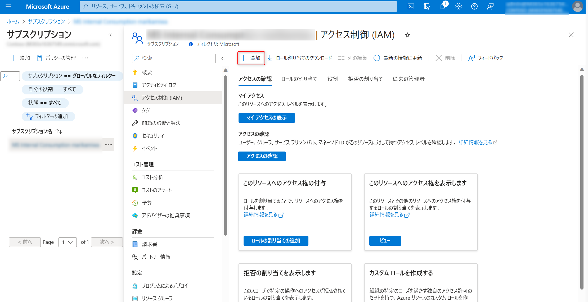

> [!NOTE]
> 本記事は Technet Blog の更新停止に伴い [TechNet Blog](https://blogs.technet.microsoft.com/jpazureid/2017/12/12/about-azure-ad-b2b/) の内容を移行したものです。元の記事の最新の更新情報については、本内容をご参照ください。

> [!NOTE]
> 2017-12-12: 本記事の初版を投稿  
> 2023-04-01: 画面ショットや Azure ポータル上のメニューの変更に伴い内容を更新

# Azure AD B2B とは

こんにちは、Azure & Identity サポート チームの三輪です。

今回は Azure AD B2B (Business-To-Business) コラボレーション機能 (以下、Azure AD B2B) について紹介します。この記事はもともと 2017 年 12 月に公開されましたが、その後 Azure ポータルのメニューなどが変更されたため、内容を最新版に更新いたしました

Azure AD B2B の概要については、公開ドキュメントである [B2B コラボレーションの概要](https://docs.microsoft.com/ja-jp/azure/active-directory/active-directory-b2b-what-is-azure-ad-b2b) をまずご覧ください。

Azure AD B2B と聞くと、もしかしたら小難しく聞こえるかもしれませんが、要は他の Azure AD テナント上のユーザーを自テナントに追加 (招待) する機能のことです。具体的には、Azure AD を利用する中で、次のような要望がでてくることがあります。

- 会社間 (Azure AD テナント間) で自社が公開しているリソースを共有したい
- 別の Azure AD テナントに紐づいているリソースを使用したい
- ひとりの管理者で、複数の Azure AD テナントを管理したい 等

このような連携が必要な時に利用する機能が、今回紹介する Azure AD B2B になります。

## はじめに

Azure サブスクリプションは必ず 1 つの Azure AD テナントに関連付けられています。通常、このサブスクリプションが紐づく Azure AD テナントに所属しているユーザーのみがそのサブスクリプション内のリソースを管理可能です。

では、複数の Azure AD テナントがある場合はどのようになるでしょうか。この場合、そのままでは別の Azure AD テナント B からテナント A へアクセスしたり、別の Azure AD テナント A に関連付けられているサブスクリプションに Azure AD テナント B のユーザーが管理操作をおこなったりすることはできません。

こんな時、Azure AD B2B を利用することで、自身の Azure AD テナントに他テナントのユーザーを招待することで、ユーザー本体は別の Azure AD テナントに所属しながら、招待した側のテナントのリソースを利用することが可能となります。

## 詳細

別の Azure AD テナントのユーザーを自テナントに招待する方法で多く利用されるものを 2 つ紹介します。

### 1. ゲスト ユーザーの直接的な招待

明示的に別の Azure AD テナントのユーザー (または outlook.com や gmail.com など外部アカウント) を招待し追加する操作です。Azure ポータルのメニューより [Azure Active Directory] – [ユーザーとグループ] – [すべてのユーザー] – [新しいユーザー] の順に進みます。下記、[外部ユーザーの招待] からユーザーの E メール アドレス (もしくは Azure AD の UPN) を追加します。

[招待メッセージの送信] にチェックを入れると、指定されたユーザーに招待 E メールが送られますので、E メールを受け取ったユーザーは、その E メールのリンクからウィザードを完了することができます。

### 2. RBAC (アクセス制御 IAM) によるユーザーの招待

RBAC を用いて、Azure サブスクリプションに紐づけられている Azure AD テナント上のユーザーに対してアクセス許可を割り当てることができます。では、RBAC でアクセス権を割り当てるときに別の Azure AD テナントのユーザーを指定したい時には、先に 1 の作業を実施しておく必要があるのでしょうか？

いいえ、もしアクセス許可を割り当てようとしているユーザーがそのテナントに存在していない場合には、RBAC の設定時に自動的に 1 のユーザー招待も併せて行われます。手順としては、Azure ポータルの [サブスクリプション] – [サブスクリプション名] – [アクセス制御 (IAM)] の順にお進みください。下記、[追加] から別の Azure AD テナントのユーザーを追加することができます。指定された E メール アドレスには、招待 E メールが送られ、その E メールよりウィザードを完了する流れは同様になりますが、同時にサブスクリプションに対するロールが割り当てられます。

## よくあるお問い合わせ

Q. B2B の機能以外で Azure AD 間の連携を行うことは可能ですか？

A. いいえ、テナント間での連携を行いたい場合は、Azure AD B2B を利用することが基本です。Azure AD のテナント間同機の仕組みでも、Azure AD B2B の仕組みが利用されています。Azure AD B2B の機能は Azure AD のテナント同士を連携するものではなく、 Azure AD テナントと別の Azure AD テナントのユーザーを連携する機能とお考えください。

Q. 別の Azure AD テナントに登録されたアプリケーションを利用するのに、Azure AD B2B の機能を利用できますか？

A. はい、B2B の機能で要件を満たせます。Azure AD B2B の機能で別の Azure AD テナントのユーザーを自テナントに招待することで、その招待されたユーザーが 自テナント (自社の Azure AD テナント) 上のアプリケーションを利用することが可能となります。

## おわりに

今回は、Azure AD B2B に関する概要について紹介しました。Azure AD B2B に関するトラブルや Azure AD B2B 完了後のトラブル、または招待 E メールを利用しない方法などの記事も必要に応じて参照ください。また、それでも問題が解決しない場合は、弊社サポートまで遠慮なくお問い合わせください。
