# TPM のエラーについて

こんにちは、Azure Identity の鶴巻です。  
今回は定期的にお問い合わせをいただく Trusted Platform Module (トラステッド プラットフォーム モジュール、TPM) のエラーの説明と対処手順を紹介します。

## Trusted Platform Module のエラー

いきなりですが、Office 製品などを利用している際に下記のようなエラーに遭遇したことはありませんでしょうか。  

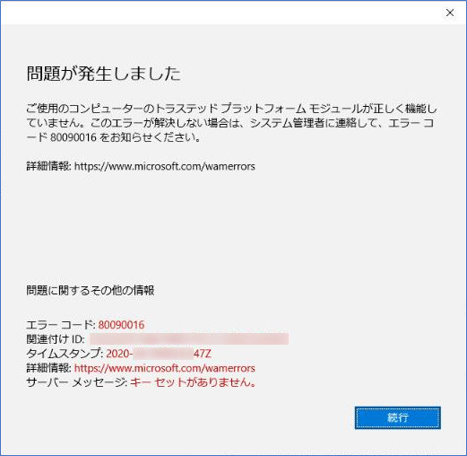

このエラーは、Windows デバイスが Azure AD に登録されている場合に、何らかの理由により Windows デバイス上の Trusted Platform Module (TPM) と呼ばれるハードウェアに問題が生じている場合に発生します。

Azure AD に Windows デバイスが登録されている場合、Azure AD との認証にプライマリー リフレッシュ トークン (PRT) と呼ばれるトークンが利用されますが、このトークンの利用に TPM が活用されています。  
上記のエラーは、Azure AD 認証を行うために TPM にアクセスしたものの、必要な情報を TPM から取得できなかったことを示しています。

このエラーが発生している場合、後述の方法により事象が改善するかどうかお試しください。

なお、下記のようなエラーが発生するとの報告もいただいています。  
いずれも TPM の利用に何らかの問題が発生している可能性があるため、後述の内容が参考になればうれしいです。  

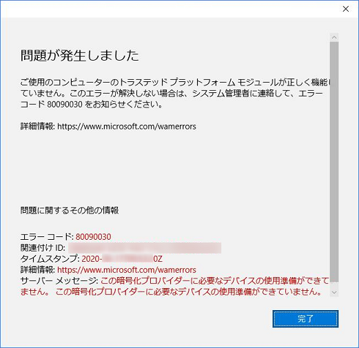

## Trusted Platform Module とは何か

Trusted Platform Module (TPM) とは、セキュリティ関連の機能を提供するために特別に設計されたハードウェアです。
TPM は、エンタープライズの環境で利用される Windows デバイス に搭載されていることの多いハードウェアです。
Windows の機能の一つとして BitLocker という言葉を耳にされたことがある方も多くいらっしゃると思いますが、このような Windows で利用されているセキュリティ関連の機能を実現するために TPM が利用されています。

[トラステッド プラットフォーム モジュール](https://docs.microsoft.com/ja-jp/windows/security/information-protection/tpm/trusted-platform-module-top-node)

## Azure AD と TPM

Azure AD と TPM はどのような関係があるのでしょうか。  
実は、Azure AD にデバイスを登録した際に発行される「プライマリー リフレッシュ トークン (PRT)」をデバイス側で保持するために、TPM が搭載されているデバイスにおいては TPM が利用されます。  
具体的には、Azure AD にデバイスを登録する際に、Windows デバイスは自身の TPM を利用して暗号キーを作成し保存します。  
そして、この暗号キー情報を使用して Azure AD にアクセスするために使用する PRT と呼ばれるトークンを取得します。

[プライマリ更新トークンとは](https://docs.microsoft.com/ja-jp/azure/active-directory/devices/concept-primary-refresh-token)

## TPM のエラーの対処方法について

このように TPM は Windows デバイスに搭載されている専用のハードウェアとなりますため、TPM の動作に何らかの問題が生じている場合は Windows の資格情報とは異なり Office 365 ProPlus などの製品を修復インストールしても回復しません。

下記のステップを順次実行いただき、事象が改善するかどうかご確認ください。

1) TPM をリセットする
2) Azure AD Registered を解除し再度登録する

### 1) TPM をリセットする

下記参考サイトをご参照いただき TPM をリセット可能かご確認ください。  
[TPM をクリアする方法 | Ask CORE](https://docs.microsoft.com/ja-jp/archive/blogs/askcorejp/tpmclear)
  
```
3-1. それぞれの機能、アプリケーションごとに確認した ”TPM をクリアする前に実施する手順" を行います。
3-2. [ファイル名を指定して実行] で "tpm.msc" を入力し TPM 管理コンソール画面を起動します。
3-3. "TPM をクリア" ボタンをクリックします。
3-4. 画面に従ってコンピューターを再起動します。
3-5. 次回起動時にハードウェア側の画面が表示されますので、画面に従って TPM クリアを実行します。
3-6. それぞれの機能、アプリケーションごとに確認した "TPM をクリアした後に実施する手順" を行います。
```

TPM のリセットは、BitLocker や Windows Hello など、TPM を利用している機能やアプリケーションに影響をおよぼす可能性があります。弊社製品につきましては、上記参考サイトに、それぞれ TPM のクリア前後に行うべきこと、影響範囲についてまとめております。

<span style="color:red;">**※※※ ご注意ポイント ※※※**</span>  
ドメインからの離脱やアカウントを削除する手順も含まれておりますため、**<u>必要なファイルやフォルダーなどの情報をユーザーに依存しないドライブやファイル サーバー上などへバックアップいただくよう何卒お願いいたします</u>**。  
他社製品への TPM リセットの影響につきましては、恐縮ながら弊社では判断がいたしかねますため、開発ベンダー様へ TPM リセットの影響について別途ご確認をお願いいたします。

### 2) Azure AD からデバイス登録を解除し再度デバイス登録する

「Azure AD 参加」、「ハイブリッド Azure AD 参加」、「Azure AD 登録」のそれぞれのパターンについて上記の資料内に手順が記載されていますが、念のためそれぞれの手順をご確認ください。

#### Azure AD 参加

もしすでに Azure AD から切断している場合は、手順 7. からご実施ください。

1. 通常デバイスを利用するユーザーでデバイスにログオンします。
1. [スタート] - [設定] (歯車のマーク) - [アカウント] - [職場または学校にアクセスする] を開きます。
1. 以下のように、"〇〇〇 の Azure AD に接続済み" のエントリを選択し、[切断] をクリックします。  
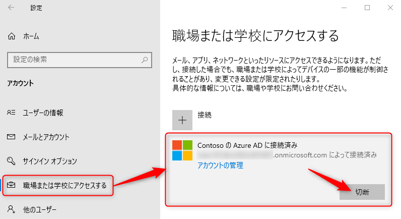
1. 以下のポップアップが表示されたら、内容を確認の上 [はい] および [切断] をクリックします。  
  

1. 以下のポップアップが表示されたら、Azure AD から切断後にデバイスにサインインするユーザーのアカウントを入力し [OK] をクリックします。  
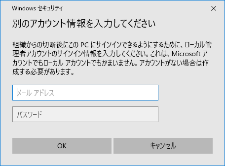
1. 以下のポップアップが表示されたら、[今すぐ再起動する] をクリックし、デバイスを再起動します。  
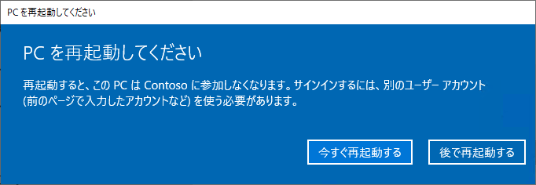
1. 職場または学校にアクセスするの画面にて "職場または学校アカウント" の情報が消えていることを確認します。  

1. Azure ポータル上でも、当該デバイスが削除されていることを確認します。もし、削除されていない場合、手動で削除します。
1. 再度 [職場または学校にアクセスする] で Azure AD に再参加します。  
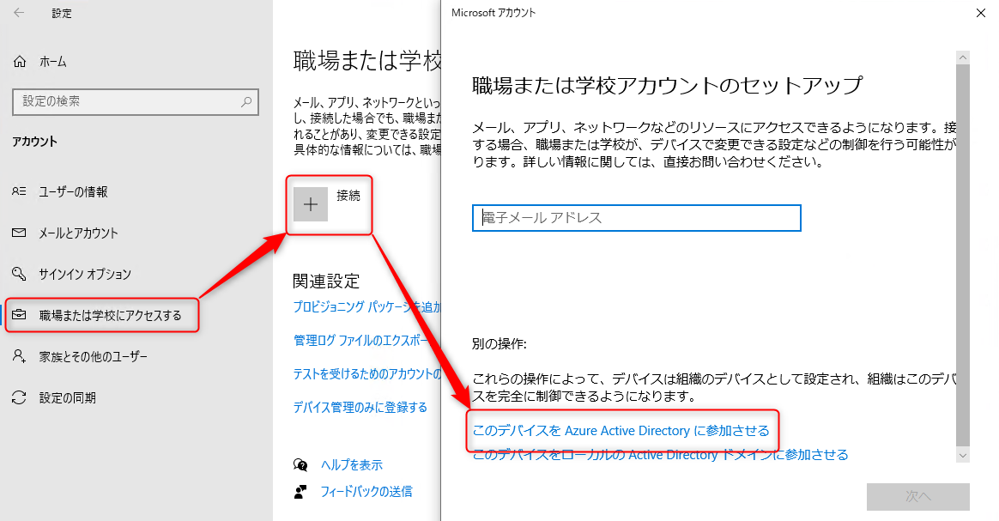


#### ハイブリッド Azure AD 参加

もしすでにオンプレミス AD から切断している場合は、手順 7. からご実施ください。

1. 通常デバイスを利用するユーザーでデバイスにログオンします。
1. [スタート] - [設定] (歯車のマーク) - [アカウント] - [職場または学校にアクセスする] を開きます。
1. 以下のように、"〇〇〇 AD ドメインに接続済み" のエントリを選択し、[切断] をクリックします。  
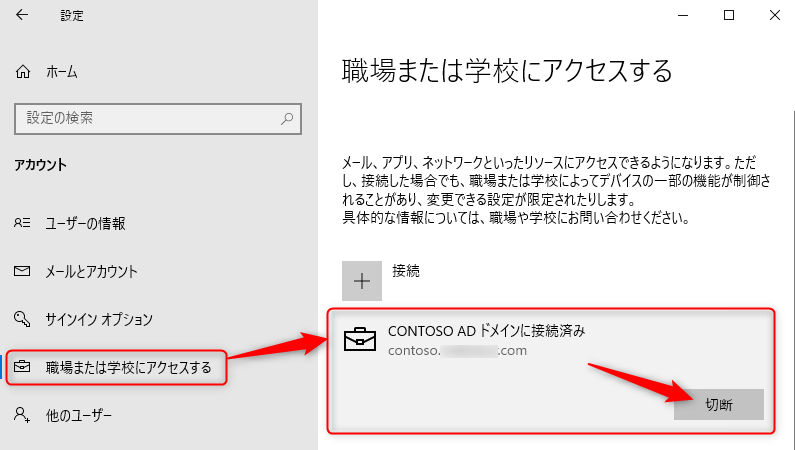
1. 以下のポップアップが表示されたら、内容を確認の上 [はい] および [切断] をクリックします。  
  
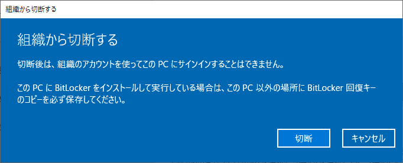
1. 以下のポップアップが表示されたら、オンプレミス AD から切断後にデバイスにサインインするユーザーのアカウントを入力し [OK] をクリックします。  

1. 以下のポップアップが表示されたら、[今すぐ再起動する] をクリックし、デバイスを再起動します。  
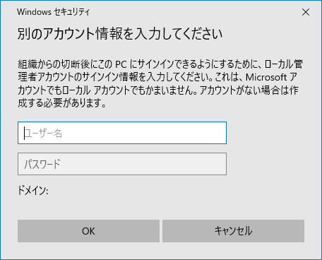
1. 職場または学校にアクセスするの画面にて "職場または学校アカウント" の情報が消えていることを確認します。  
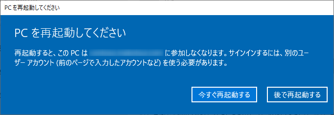
1. オンプレミス AD と Azure AD が同期されるまで念のため待機します。(既定では 30 分程度)
1. 再度 [職場または学校にアクセスする] でオンプレミス AD に再参加します。  
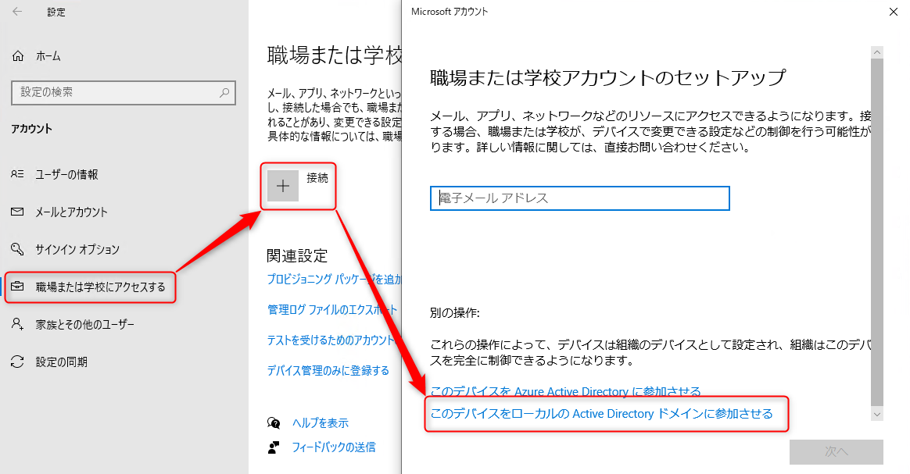
1. オンプレミス AD と Azure AD が同期されるまで待機します。(既定では 30 分程度)
1. Azure ポータル上でハイブリッド Azure AD 参加が再構成されたことを確認します


#### Azure AD 登録

もしすでに登録が解除されている場合は、手順 5. からご実施ください。

1. 通常デバイスを利用するユーザーでデバイスにログオンします。
1. [スタート] - [設定] (歯車のマーク) - [アカウント] - [職場または学校にアクセスする] を開きます。
1. 以下のように、"職場または学校アカウント" のエントリを選択し、[切断] をクリックします。  
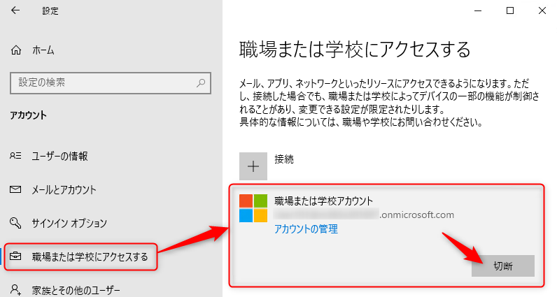
1. 以下のポップアップが表示されたら、内容を確認の上 [はい] をクリックします。  

1. 職場または学校にアクセスするの画面にて "職場または学校アカウント" の情報が消えていることを確認します。  
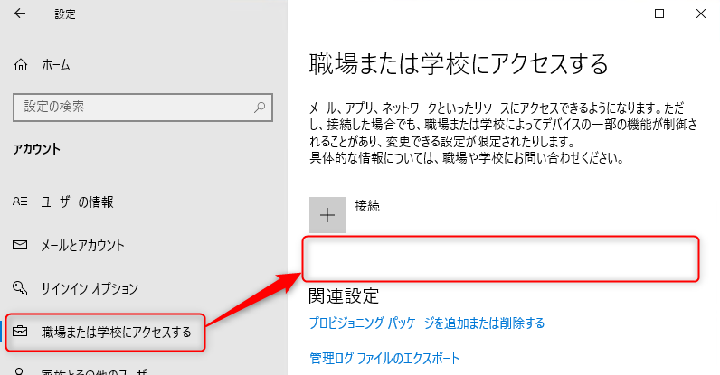
1. Azure ポータル上でも、当該デバイスが削除されていることを確認します。もし、削除されていない場合、手動で削除します。
1. 再度 [職場または学校にアクセスする] で Azure AD にデバイスを再登録します。  
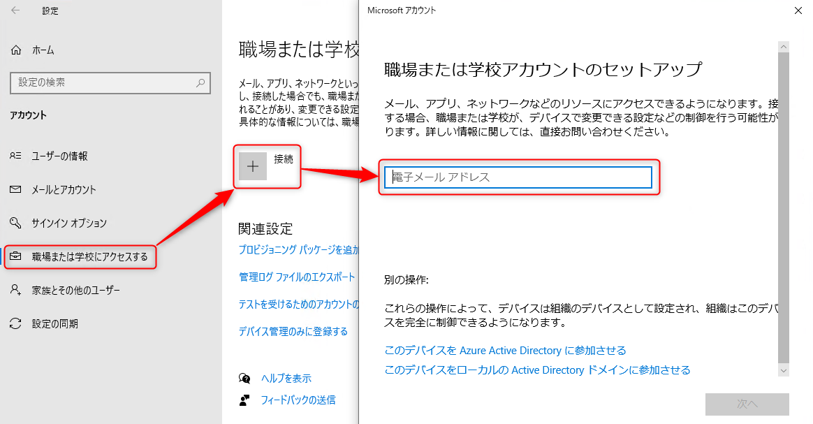


今回の記事は以上となります。
TPM に関連していそうなエラーが表示された場合には、環境に合わせて上記の手順をお試しいただければ幸いです。


