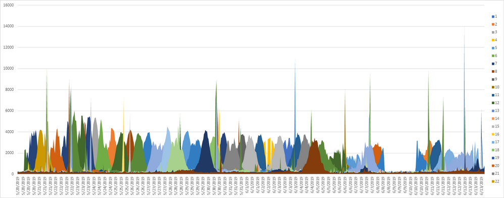

# パスワードで攻撃は防げない - Your Pa$$word doesn't matter 
 
こんにちは、Azure Identity サポートチームの鈴木です。

本記事は [Your Pa$$word doesn't matter](https://techcommunity.microsoft.com/t5/Azure-Active-Directory-Identity/Your-Pa-word-doesn-t-matter/ba-p/731984) を意訳したものになります。ご不明点等ございましたらご連絡ください。

---------------------------------------------------------
セキュリティに関して組織の方針を決定できる方との会話の中で 「これまでに漏洩したことがあるパスワードは絶対に再度使用するな」「長いパスワードを使用したほうがいい」「パスワードよりも長いパスフレーズを使えばいい」などなどの話題がでます。実はこれらは、これまでの研究[結果](https://aka.ms/passwordguidance)と異なっており、マイクロソフトが毎日何億ものパスワードベースの攻撃を防いでいる状況から見ますと正しくありません。多要素認証 (MFA) や脅威の検出の仕組みなど本当に価値のあるものにではなく、パスワード規則に着目しても、気晴らし程度の効果しかありません。

ここでは、パスワードの構成や長さに関しては（ほとんど）意味がないということをお伝えしていきます。
 
その理由を理解するために、パスワードに対する主な攻撃としてどのようなものがあるか、そして、攻撃者の観点でパスワード自体をどういった要素に分解できるか見てみましょう。ご存知のとおり、すべての攻撃者はパスワードを盗み、アカウントにアクセスすることを目的とします。 
実際のところ攻撃者は簡単な攻撃手法が見つからない、かつ攻撃対象にその価値があると判断した場合に限って、セキュリティのカンファレンスなどで耳にするような本当に奇抜で、クリエイティブな手法で攻撃を仕掛けます。
 
ここでは、パスワードを突破するいくつかの最新の手口を見てみましょう。
(掲載している統計データは Azure Active Directory 上のアカウント (ハイブリッドまたはクラウドのみ) のものであり、オンプレミス環境の情報は含まれていません。)

|**攻撃**|**別名**|**頻度**|**メカニズムの難易度**|**攻撃を招くユーザーの行動**|**パスワードはセキュリティ対策に重要か？**|
|:--|:--|:--|:--|:--|:--|
|クレデンシャル スタッフィング (Credential Stuffing)|攻撃のリプレイ (Breach replay) 、リスト型攻撃 (list cleaning)|非常に高い - マイクロソフトの ID 管理システムでは 1 日に 2000 万のアカウントが攻撃対象となっています。|非常に容易: 侵害されたサイトから資格情報を収集して、ほかのシステムとマッチするか試します。 List cleaning 用のツールは容易に手に入ります。|人間である限り攻撃を招く可能性があります。新しいパスワードを考えるのはユーザーの負担となるため、 [62% のユーザーがパスワードを再利用してしまいます](https://www.darkreading.com/informationweek-home/password-reuse-abounds-new-survey-shows/d/d-id/1331689) 。|**いいえ** - 攻撃者は正確なパスワードを保持しているため。|
|フィッシング (Phishing)|中間者攻撃 (Man-in-the-middle)、資格情報の傍受 (credential interception)|非常に高い: 全受信メールの 0.5% を占めます。|容易: 娯楽や恐怖をあおるメールを送り、本物そっくりの偽サイトへユーザーを誘導します。資格情報を抜き取ります。Modlishka などのツール使うことで容易に偽サイトを構築できます。|人間である限り攻撃を招く可能性があります。人はだれしも興味をそそられたり、不安をあおられたり、警告を無視したりすることがあります。|**いいえ** - ユーザーは攻撃者にパスワードを教えてしまっているため。|
|キー入力のログ (Keystroke logging)|マルウェア、 盗聴|低い。|中間: マルウェアが入力されたユーザー名とパスワードを記録するが、さらに通常は他にもすべての情報を記録するため、攻撃者はそれらを解析する必要があります。|リンクのクリック、管理者として実行、マルウェアのスキャンを行わないこと。|**いいえ** - マルウェアが入力された情報を正確に窃取しているため。|
|お客様環境での探索 (Local discovery)|ゴミ箱あさり (Dumpster diving)、物理的な探索 (physical recon)、ネットワークのスキャン (network scanning)|低い。|難しい: ユーザーのオフィスや書類からパスワード情報を探り出します。だれでもアクセスできる共有フォルダーを探す。 コードやメンテナンス スクリプトにある資格情報をスキャンします。|パスワードをメモしておくこと (パスワードが複雑な場合や、SSO が導入されていない場合に起こります) 。無人の (サービス) アカウントに対してパスワードを使用すること。|**いいえ** - 正確なパスワードが発見されてしまうため。|
|脅迫による強奪 (Extortion|脅迫メール (Blackmail)、インサイダーの脅威 (Insider threat)|非常に低い - 映画だとかっこいいんだけど。|難しい: アカウントの保持者を脅したり、金銭で釣るなどして、資格情報を得ます。|人間である限り完全に防ぐことができません。|**いいえ** - 正確なパスワードを知らせてしまうため。|
|パスワード スプレー|推測 (Guessing)、hammering-low-and-slow|非常に高い: 攻撃の 16% 以上を占めます。1 日に数十万アカウントが突破されることもあります。毎日数百万アカウントが攻撃されています。|容易: 簡単に手に入るユーザー リストを使用して、非常に多くのユーザー名に対して同じパスワードで攻撃します。速度を調節したり、多くの IP アドレスに分散したりすることで、検出されないようにしています。容易で安価に利用できるツールがあります。|人間である限り完全に防ぐことはできません。qwerty123 や Summer2018! といったよくあるパスワードを使用します。|**いいえ** - **ただし**、攻撃者がよく試すパスワードを使用しない限りは安全です。|
|ブルート フォース攻撃 (Brute force)|データベースの抜き取り (Database extraction)、クラッキング (cracking)|非常に低い。|様々: データを抜き取るためにネットワークに侵入します。標的の組織が脆弱な場合 (管理者アカウントがパスワードのみで保護されているなど) の場合は容易ですが、物理的なセキュリティや運用のセキュリティを含め、データベースが適切に防御されていれば困難です。パスワードにハッシュ クラッキングを実施します。難易度は使用する暗号によって異なります。詳細は以下を参照。|なし。|**いいえ** - **ただし** 、あまり使用されないパスワード (パスワード マネージャー) を使用しているか、クリエイティブなパスフレーズを使用している場合は影響があります。詳細は以下を参照。|

パスワード スプレー攻撃とブルート フォース攻撃に対しては、どのようなパスワードを設定しているかが影響を及ぼします。読み進める前に、まだの場合は、まず [MFA を有効にしましょう](https://aka.ms/securitysteps) 。次にこれら 2 つに対抗するのに「良いパスワード」とは何か掘り下げてみましょう。

## パスワード スプレー

はい、これは簡単で、容易に推測されないパスワードを設定すればよいです。
しかしここで言う容易とは、文字どおりの **容易** とは少し異なります。
昨年我々のチームが防いだパスワード スプレー攻撃を見てみると、攻撃中に約 10 種類のパスワード (少ないときには 2 種類、多いときには 50 種類のパスワード) を使って攻撃していることが分かっています。

パスワード スプレー攻撃に関しては、検出が可能であり、一度検出されるとログイン サーバーは攻撃をシャットアウトすることが可能です。
攻撃者が早く攻撃するほど早く検出されるので、攻撃はゆっくりと日数をかけて行われます。
つまり、パスワードは一つ一つある程度の確度で可能性が高そうなものを推測して行われるということを意味します。攻撃者は検出される前に成果を最大化する必要があるため、すでに漏洩した資格情報から作成したヒストグラム (どのような値が多いか、そのばらつきをグラフ化したもの) を使用し、攻撃を行います。

下のグラフはパスワード スプレー攻撃の最近の一例です。
各色は失敗したパスワード要求のハッシュ値を表し、グラフの山はその時間枠において同じハッシュ値で複数回失敗したことを表しています。
グラフから 2 つの異なる攻撃者がいるとみられます。低い山では、1 時間あたり約 4,000 アカウントに 22 種類のハッシュで 45 回のパスワード要求を試行しており、高い山では 2 週間以上にわたって 1 時間あたり約 10,000 アカウントで 15 種類のハッシュを試行しています。
攻撃者が複数のハッシュを同時に使用していることがわかります。

 
もしあなたのパスワードが攻撃者の試行するリストに入っていないのであれば、影響が及ぶ心配はありません。
攻撃者たちはほとんどの場合同じリストを使って攻撃するため、同じパスワードで試行します。
以下にマイクロソフトへの攻撃でよく使用される上位 10 個のパスワードを示します。

1.	123456
2.	password
3.	000000
4.	1qaz2wsx
5.	a123456
6.	abc123
7.	abcd1234
8.	1234qwer
9.	qwe123
10.	123qwe

ご覧のとおり、特に手の込んだものではありません。ユーザーがこれらのパスワードを選択する主な理由は、上位ビットが単純であるためです。キーボードに沿って指を動かすだけで、上記の上位 10 個のパスワードが出来上がります。攻撃者は、過去に起きたパスワード漏洩の統計情報をもとにこれらのパスワードを試行しますが、より標的を絞った高度な攻撃者は、あなたの会社のパスワードの複雑さと有効期限のルールも考慮して、より精度の高い攻撃を仕掛けてくる可能性があります。例えば、パスワードの複雑さと有効期限のルールを使用している場合、「Summer2019!」はほとんどの複雑さの要件を満たし、そして簡単に覚えられます (パスワードの複雑さも有効期限のルールも明らかに有害ですので、どちらも使用しないことを推奨します。その理由については [https://aka.ms/passwordguidance](https://aka.ms/passwordguidance) を参照ください)。また、攻撃者は従業員が具体的に使いそうなパスワードを巧みに試行するかもしれません。
たとえば、マイクロソフトに対しては、「Office2019」、「Azure19」、または「XboxOne」を試す可能性があります。

しかし、平均的な攻撃者は検出システムに対する応答が非常に遅く、少しの推測しか試すことはできません。したがって、あなたのパスワードが、攻撃者が試行している短いリストに含まれている場合には問題となります。管理者は、パスワードの作成または変更時に、これらの一般的に攻撃されるパスワードの使用を防ぐ必要があります。マイクロソフト アカウントでは、このアプローチを長年使用してきました (Xbox、Skype、Outlook、OneDrive などの一般消費者向けサービスの認証システム) 。この時点で、パスワード スプレー攻撃を効果的に防いでいます (Azure Active Directory にも [Password Protection](https://docs.microsoft.com/en-us/azure/active-directory/authentication/concept-password-ban-bad) と呼ばれる同様のシステムがあります) 。

したがって、パスワード スプレー攻撃に関して言えば、あなたのパスワードは (よく使われるパスワード トップ 50 に入っていなければ) 問題ありません！

## ブルート フォース (データベースからの抜き取りとクラッキング)

これは「データベースが抜き取られてしまった場合」の話です。ほとんどの組織は、セキュリティの侵害が生じたときに口を閉ざすため、Active Directory ドメイン コントローラーを利用している場合にどのくらいの頻度でこういった攻撃が起きているか、よい数字を我々も持っていません。クラウド上の資格情報のハッシュについては、抜き取りを検出するためにシステム内に沢山の検出システムを展開しています (セキュリティの理由でそれらの検出システムの詳細についてはここでは説明しません) 。我々のクラウド システムから資格情報が抜き取られたという痕跡はありませんが、長年にわたり他の大規模システムに起きた知名度の高いハッキングの話などを耳にすると、私たちも謙虚で警戒を怠ってはいけないと教えてくれます。そういったハッキングは必ず起こりえます。

話が理解しやすくなるよう、ここで少し暗号について解説します。最初にいくつか定義の説明をします: 

- ハッシュ化 (Hashing) とは一方行の、復元不能なパスワード変換を意味します。マイクロソフトでは、任意の文字列を 256 ビットのシーケンスに変換する SHA256 を使用しています。この方法ではオリジナルのパスワードを復元することは数学的にできません。
- 反復 (Iterating) とはアルゴリズムを繰り返すこと、つまり一回ごとに同じ量の計算能力を消費することを意味します。
- ソルト (Salt) とはハッシュする前のパスワードに何かを追加することを意味します。よって同じパスワードでもユーザーが異なれば違うハッシュ値が得られます。Salt がない場合、攻撃者にパスワードが突破されてしまうと、同じパスワードを使用しているすべてのアカウントにアクセスできるようになってしまいます。Salt がある場合は、攻撃者は 1 度に 1 つのアカウントを攻撃することになります。なぜならハッシュを事前に計算することはできず、またデータベース全体を検索しても同じ値は得られないからです (Salt は「秘密のもの」ではなく、通常はハッシュとともに保管されます。ハッシュを手に入れた攻撃者は Salt も手に入れています) 。

[Azure Active Directory](https://docs.microsoft.com/en-us/azure/active-directory/hybrid/how-to-connect-password-hash-synchronization) はソルト付きのパスワードを SHA256 で 1000 回反復し、ユーザー毎のパスワード ハッシュを生成しています。もし入力となるパスワードがオンプレミスから同期されている場合、オンプレミスのパスワード ハッシュを受け取り、同じスキームを使って再度ハッシングします。つまりパスワードを直接保管していません。アルゴリズムを反復することで、生成されたハッシュの比較を行い、ログイン時に受け取ったパスワードと事前に設定されたパスワードが同じであるかを確認します。これに加えて、パスワードを保管しているデータベースは暗号化されています (データの暗号化もデータを攻撃者から読み取れないようにしますが、鍵を使って元の値を復元することが可能です) 。そして Bitlocker を使って暗号化されたドライブに保管されます。

オンプレミスの AD 環境からデータを抽出するために、攻撃者はドメイン コントローラーからファイルを抜き取る必要があります。通常、セキュリティ ポリシーにもよりますが、これは攻撃者がネットワーク内でドメイン管理者の状態になっていることを意味します。これにはある程度の労力が必要です。Azure Active Directory のクラウド環境からデータを抽出するためには、攻撃者は環境にアクセスする権限、データベースを復号すること、もし物理的に盗むなら Bitlocker の鍵を突破する力も必要です。これにはさらに相当な労力を要するでしょう。パスワードは見つけたり (再利用)、推測したり (スプレー)、うまく尋ねたり (フィッシング)、して手に入れることもできますから、通常はそんなに手間のかかる攻撃をすることはありません。

しかし、攻撃者がハッシュをたくさん保存されたデータベースを手に入れたとしましょう。さてどうするでしょうか。

1.	**クラッキング用のマイニング マシンを入手する。** 暗号通貨市場により、コストが非常に低下しており、2019 年 7 月現在、$20,000 (約 210 万円) で SHA256 に対して毎秒 [1000 億 (100B) を超えるパスワードをクラックするマイニング マシン](https://en.bitcoin.it/wiki/Mining_hardware_comparison) を構築することが可能になっています。組織的な犯罪や政府であれば、膨大な予算を持っており、量子コンピューターが実現すればこの数値をさらに加速させていくでしょう。
2.	**アルゴリズムやソルト、その組織独自のパスワード規則 (最小 / 最大長さや、複雑さなど) を調べる。** これは通常容易で、マイクロソフトの場合は公開もしています。もし知られていない場合でも、攻撃者はシステムの中で少なくとも１つのアカウントをすでにコントロールしており、アルゴリズムをリバース エンジニアリングして、任意のパスワードを挿入することができると想定しておいた方が良いです。
3.	**パスワードの初期リストを作る。** まずは、漏洩、フィッシングまたはパスワード スプレー攻撃で明らかになった 5 億以上もの [パスワード](https://www.troyhunt.com/introducing-306-million-freely-downloadable-pwned-passwords/) を取得します。これは「誰もが考えたことのあるすべてのパスワード」と考えてください。一部のガイダンスでは、このリストのすべてのパスワードを禁止しています。まずは試しにそのすべてのパスワードを禁止してみて、ユーザーがパスワードを選択する際にどの程度うまくいくか確認ください (うまくいかないでしょう)。
4.	**標的のアカウントに対して、その一覧のすべてのパスワードを試す。** 統計的には、これだけでもユーザー パスワードの 70% が突破されてしまいます。 5 億 (500M) は 10 億 (1B) の半分で、家庭用のマイニング マシンでも、1 秒間に 1000 億 (100B) のパスワードを推測できます。つまり、完全なリストでも 5ms しか時間はかかりません。攻撃者はマイニング マシンを用いて毎秒 200 アカウントに対して完全なリストを走らせます。そうです、つまりほとんどのアカウントが一瞬にして陥落してしまうのです。このため、データベースからの抜き取りを検知するのは、異常なログオンを検知するのと並んで非常に重要ですから、なんにせよ MFA を有効にしておくことが大事です！
5.	標的となるアカウントのパスワードがまだ突破されていない場合は、 **すべての人気フレーズ、歌詞、ニュース見出し** 、検索エンジン、ウィキペディア、人気記事などからピックアップできるもののリストを作成します。こういったリストは、ハッシュ ブレーカー コミュニティと呼ばれるパスワードのクラッキング コミュニティで事前にパッケージ化されていて容易に手に入ります。これにより、さらにユーザー パスワードの 5 - 7% が突破される可能性があります。
6.	まだ標的のアカウントが突破できない場合、攻撃者は **マイニング マシンと時間が許す限りあらゆる組み合わせのパスワードを試行します** 。キーボードから簡単に打てる 96 文字で仮定すると、パスワードのそれぞれの値の位置に 96 通りのパターンが考えられます。このような力ずく (ブルート フォース) の手法では、1 秒あたり 1000 億個のパスワードを試行するマイニング マシンでも、非常にコストが高くなります。実際にはこのマイニング マシンを使用すると、攻撃者は 1 日で最大 8 文字、3 か月で 9 文字、21 年で 10 文字、そしてそれ以上の文字は 96 倍の時間を費やせば、すべてのパスワードを試すことができますが、実際には攻撃者は 9 文字でお手上げになります。ここまでやれば、おそらくさらに 5% のパスワードが突破されています。

    |パスワードの長さ|可能な文字列の組み合わせ|要する秒数|要する分数|要する時間|要する日数|
    |:--|:--|:--|:--|:--|:--|
    |6|782,757,789,696|8|0.13|0.002|0.00009|
    |7|75,144,747,810,816|751|12.52|0.21|0.01|
    |8|7,213,895,789,838,340|72,139|1,202.32|20.04|0.83|
    |9|692,533,995,824,480,000|6,925,340|115,422.33|1,923.71|80.15|
    |10|66,483,263,599,150,100,000|664,832,636|11,080,543.93|184,675.73|7,694.82|

    (この表から、反復の回数を増加させても基本的に攻撃は線形に減少していくことが分かります。反復の回数を 1,000 回から 10,000 回に増やしても、追加で 1 文字を得ることさえできません。次の 1 文字を得るためには、100,000 回反復する必要があり、これには 100 倍のサーバーおよびラックの領域、およびエネルギー消費量が必要となります。)

7.	最後に、攻撃者は予測可能なパターン (例えば、常に大文字で始まり、小文字が 3-6 文字続き、2-4 文字の数字が続き、最後に感嘆符 (!) を追加する、など) を使用して、使用されている可能性の高い大体 12 文字の推測可能なパスワードのリストを作成します。数パーセントと小さいですが更にアカウントが得られます。
8.	ソルトのため、これらはすべて **1 つの** アカウントに対する操作です (しかし、成功確率は約 85% です)。攻撃者はパスワードがほしい次のアカウントに対して 1 からやり直す必要があります。

重要なのは、パスワードが漏洩した場合、12 文字より長くこれまで使用したことがない場合 (つまりパスワード マネージャーで生成したパスワード) を除いて、あなたのパスワードは攻撃者には無力であるということです。パスワード マネージャーを使えるユーザーもいると思いますが、利用が禁止されているユーザーも一部にはいるでしょう。パスワード マネージャーを使用している場合は、可能な限り最大の長さのパスワードを使用しましょう。すでにコピーアンドペーストしているのであれば、文字列が長くても使いにくくなるということはないでしょうから。パスワード マネージャーには独自の問題 (ユーザービリティや価値あるパスワード情報が集約されているため攻撃の標的となりやすいなど) がありますが、パスワード マネージャーは長くてランダムな文字列を生成するため (こういった攻撃に対して) 意味ある違いが生じます。

または、単に MFA を有効にするのでもよいです。究極的には、データベースの抜き取りとクラッキングによるセキュリティ侵害は、推測やフィッシング、またはリプレイと同じとも言えます。攻撃者は奪い取ったパスワードを使用してログインする必要がありますから、その時点で MFA が安全装置となってくれるでしょう。

## まとめ

パスワードスプレー攻撃 (辞書に載っていたりするような推測されやすいパスワードを避ける) またはブルート フォース攻撃 (8 文字以上のパスワードを使用するか、本当に気になる場合はパスワード マネージャーを使用する) を除いて、パスワードでは攻撃を防げません。なんというか、あなたのパスワードであれば大丈夫とは言いづらいというか、推測、漏洩、フィッシングまたは再利用される可能性を考えると、 **間違いなく** だめでしょう。あなたのパスワードでは攻撃を防げませんが、MFA は防げます！調査によると、[MFA を使用すれば](https://aka.ms/securitysteps)、アカウントが侵害される可能性は 99.9% 以上低くなります。

より洗練された MFA のフィッシングや、より巨大なクラッキング リグ (マイニング マシン) (量子コンピューターを含む) が増えてきたこともあり、現在 **本当に** 必要とされているのは、FIDO2 のようなクライアント ハードウェアに統合された、暗号的に強力な資格情報です。ただし、現在および次世代の資格情報の評価については、別のブログでお話ししたいと思います。

皆さんどうかご無事で！
