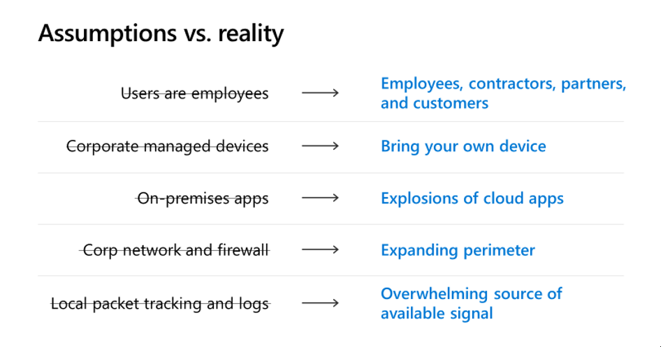
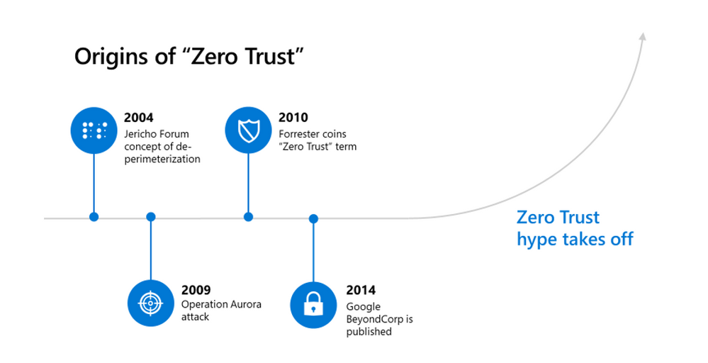
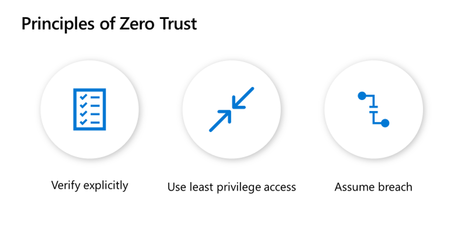
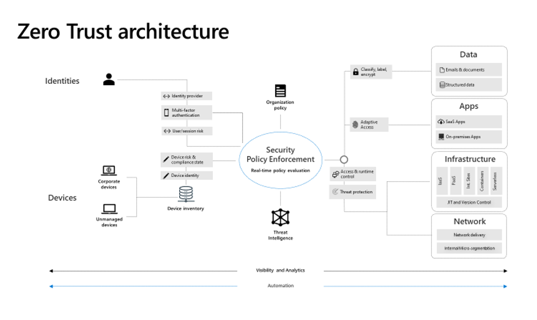

> 本記事は、 2019 年 12 月 30 日に Azure Active Directory Identity Blog に公開された記事 (Zero Hype) を翻訳したものです。原文は [こちら](https://techcommunity.microsoft.com/t5/azure-active-directory-identity/zero-hype/ba-p/1061413) より参照ください。

# ゼロ ハイプ

Ignite では、製品マーケティングを統括する同僚の Nupur Goyalstatus ([@nupur_11](http://twitter.com/nupur_11)) に加え、Azure Security Center や Microsoft Cloud App Security、およびユーザー向け Azure ATP などのプログラム マネジメントを統括する Yinon Costca ([@c0stica](http://twitter.com/c0stica)) を含めて、[ゼロ ハイプ](https://aka.ms/ztignite) と題する発表を行いました。ゼロ トラストのような概念は、あいまいなまま理解していては役に立ちません。この用語は長年にわたり話に上がってきましたが、私が話をした人の間では、この用語にはまだ一貫性や明確性が乏しい状況です。そのため、Nupur からゼロ トラストについての講演を依頼されたとき、概念に関して不明瞭な部分を全部なくすようなそんな発表をしようと提案しました。先の発表でそれが達成できていたら幸いです。セッションを見ることができなかった皆さんのために、ここでその本質をお伝えしたいと思います。

## 簡単にまとめると

ゼロ トラストは概念的には、「壁で囲まれた庭」のような境界の中は安全という従来のセキュリティ モデルは時代遅れであり、セキュリティ モデルとしてはすべてのリクエストが制御の及ばない (外部または侵害された) ネットワークから発信されたものとして扱われるべきであるというものです。これは「侵害は常に起きるもの」と考えたり、攻撃者が境界内にいるとして運用したり、また特に境界のない運用環境を考えたりなど、どれでも結構ですが要は脅威の蔓延した環境を前提に運用するということです。これはシンプルな考え方でとても意味のあることなので、これ以上複雑にしたり誇張したりする必要はありません。以下では、もう少し深く見ていきましょう。

## 昔々の話

1990 年に、私はオフィスのネットワーク構築を支援する会社を設立しました。その時代は、基本的にネットワーク間の接続方法にほとんど選択肢はありませんでした。2 つのオフィスがある場合は、Wide Area Network (専用回線) でつないでその間の通信を行いました。この世界では、リソースへのアクセスはすべて所有している建物内、所有しているマシン、雇用している人からのものであると非常に安全に想定できました。これらの前提があったため、ファイル共有は広く開かれ、ユーザー名/パスワードの組合せを持つ人なら誰でもアプリにアクセスでき、私が協力したほとんどすべての企業は、「従業員を信頼する」という考えが中心にありました。もちろん、一部例外もいましたが、それほど高度なセキュリティもなく、ネットワークへのアクセスよりも建物へのアクセスに重点が置かれていました。

それからモデムの速度が向上し、PC が安価になったことで、遠距離通信が一般的になり、VPN (電話で接続したの覚えてます？) の利用が主流になりました。1994 年までに、インターネットはアカデミアで幅広く利用され、企業は専用線の代わりに公共の通信インフラを利用し始めました。突然、プライベート ネットワークがすべて、外部の世界に接続されることとなりました。ファイアウォールの企業が生まれ、すべての予期しないまたは悪意のあるトラフィックを排除し始めることとなります。ここで壁に囲まれた庭 (境界で囲まれたネットワークではあるが、内部は本質的にはオープンな状態) が生まれました。私はこれが境界で囲まれたネットワークは安全という思い込みのきっかけだと思っています。

その後の数年間は目まぐるしい変化がありました。Netscape は 1995 年に大きく成長し、その年の 12 月に Microsoft は "インターネット ファースト" を掲げました。Salesforce は 2000 年に SaaS の提供を開始しましたし、2002 年にスターバックスがすべての店舗に WiFi を導入しました。iPhone は 2007 年に販売を開始し、Office 365 も 2011 年に開始されました。これらの変化を通し、リソースへのアクセスに関して、自前のネットワークから自身で所有するデバイスを用いて自分で展開したアプリにアクセスし、それは自社の従業員からのものであるという仮定は、徐々に有効でなくなりました。今日の IT は、壁に囲まれた庭のモデルが意図していた世界とは一変しています。これらの仮定はもはや有効ではありません。攻撃者はこれを何年も前から知っています。

## 考え方を変える

幸いなことに、これらの変化に気づき、対応したリーダーがいました。2003 年に Jericho 財団は、脱境界化の概念を紹介しました。2010 年に Forrester の John Kindervag 氏は「Build Security Into Your Network's DNA: The Zero Trust Network Architecture」という記事を執筆し、ゼロ トラストという用語が生まれました。2013 年にマイクロソフトは「アイデンティティ駆動型セキュリティ」という考えを生み出し、Enterpise Mobility Suite (EMS) をリリースして、企業のコア セキュリティとコンプライアンスのニーズ (セキュア アクセス、セキュア デバイス、セキュア データ) に対応しました。 同年、Google は「BeyondCorp」というネットワークに依存しない信頼モデルを実装し、動作するデモを提供したことで、大きな関心を呼びました。

この関心により、話が非常に大げさになってしまいました。その年の RSA では事実上すべてのブースが Zero Trust を宣伝していましたし、あるアナリストは「時代はとにかくゼロ トラストだ」と私に言ってきました。賢明な人々は同時に、何に注意を払うべきであるかわかっていましたが、一方で用語の一貫した明解な定義が見当たらないということにも気づいていました。

しかし、ゼロ トラストの本質はとても単純で、ネットワークの場所を安全性の前提にするセキュリティ モデルは不十分ということです。最新のセキュリティモデルでは、すべてのアクセス リクエストが未知のネットワークからくるということを前提にしないといけません。

## ゼロ トラストの定義を明確にする

私は時々 "FUD" というスラングを使いますが、これは、恐怖 (Fear)、不確実性 (Uncertainty)、疑い (Doubt) の頭文字をとったものです。用語を取り巻く不明瞭さを取り除くことで、ゼロ トラストの脱 FUD を試みたいと思います。まず、間違った考え方を以下に挙げます。

- **ゼロ トラストという言葉を文字どおり受け取る**: 環境内で絶対に何も信頼しないというのは、現実的でないですし可能でもありません。セキュリティ投資を考える際に、コンポーネントに障害が発生する可能性はもちろんありますし、時間とリソースにも制限があります。言葉の意味が文字どおり絶対的であるという考え方は、賢明な判断の助けにはなりません。
- **ゼロ トラストになろうとする**: 貴社がゼロ トラストの状態に「なる」ということはありません。製品がゼロ トラストに「なる」こともできません。ゼロ トラストは、資産を保護するためのアプローチです。これは、戦略と投資の指針となる考え方です。
- **ゼロ トラストはお金で買える**: 製品を購入してインストールし、ゼロ トラストに「なる」ことはできません (マイクロソフト製品でも無理です！)。リスクが蔓延している世界で、1 つの見方や 1 つのアプローチ、1 つの製品を完全に信頼することは、直感に反しています。
- **ゼロ トラストですぐに解決する**: 環境内の前提を変えていくには時間がかかります。一番盲点になっている場所から優先順位を付けていきましょう。散らかった部屋を掃除するように、ある面から始めて、うまくいったらまた先に進むように、まずは一つ取り掛かる場所を決めましょう。
- **ゼロ トラストがゴールである**: 今あなたが身に着けようとしているのは、自身が持つ前提に継続的に疑問を投げかけ、監視データと実際の違いに目を向け、現在のセキュリティ体制を根本的に疑いつづけるという考え方です。この考え方が身につけば、次はどこにどうセキュリティ投資をしていくかという方向にあなたのキャリアが向かっていくでしょう。
- **ゼロ トラストはすべての企業規模に適用可能である**: 組織にとって適切な投資は、現在のビジネス状況がどうか、何を守りたいのか、社員がどう働くのか、インフラ投資戦略はどのようなものかの組み合わせに依存します。ゼロ トラストへのアプローチも、貴社の現在の状態と知見の組み合わせで異なります。
- **ゼロ トラストは革命である**: ゼロ トラストの概念につながる変化の歴史でお話したように、サイバー セキュリティ モデル (例えば "多層防御") は何十年も進化しています。貴社が採用したものの多くは必要ですが、おそらく十分ではありません。使えるものは使ったほうがいいですが、その制約の中で貴社環境に思い込みや前提ができてしまうようなことは避けなければいけません。

## ゼロ トラストの考え方

ゼロ トラストの最も効果的なのは、それが生み出す考え方そのものだと思います。身に着けるべき考え方は、あなたが脅威の蔓延した環境にいるということです。この環境では、あなたのセキュリティ戦略の実現可能性を継続的に評価および再評価することが求められます。脅威の蔓延した環境で運用していることがわかったら、以下をご覧いただき、いくつかのキーとなる行動をとりましょう。

- **これで完璧だと思い込まない**: これはゼロ トラストの最大の変化です。小規模なネットワークと VPN の世界であれば、リクエストが既知のネットワークから発信されている場合、それは通常安全です。私たちは、昨日私たちを守ってきたモデルが明日も私たちを守ってくれると思いがちです。ゼロ トラストでは、これらの思い込みを放棄し、代わりにアクセスの可能な限り多くの側面を検証および制御します。また、実施可能な検証を明示化し、明示的に検証していないものは、不明な状態にあるということも受け入れます。
- **すべてのリソースがオープンなインターネット上にあると想定する**: 凝り固まった思い込みに対応するために、多くの顧客で有効だったアプローチの 1 つは、すべてのユーザー、デバイス、およびリソースがパブリックなインターネット上にあると想定することです。最も成功しているお客様の多くは、この考えにのっとり、できる限りのリソースをクラウドに移動し、セキュリティ戦略を最新の状態にしています。
- **単一のソースを信頼しない**: 脅威が蔓延した環境では、正確な知見が重要です。とある CISO (最高情報セキュリティ責任者) は以前に、「親父が言ってたのは、正直な人は皆同じ話をするが、嘘つきは全員違う話をする」と話してくれました。複数の情報を検証して利用するセキュリティ モデルは非常に強力です。一つの視点から検証するよりも、三点から検証するほうがはるかに正確な情報が得られます。同様に、複数の要素 (デバイスの信頼、場所、多要素認証) を活用した制御のほうが、アクセスの 1 つの側面のみを使用した制御よりも優れています。
- **侵害の封じ込め**: 脅威が蔓延している状況を想定する場合、一部の脅威が防御を突破してしまうことも考えられます。特権 ID 管理やロールベースのアクセス、役割の分離やネットワークのセグメント化などの封じ込め戦略は、防御の最初のレイヤーを突破する敵を封じ込めるのに有効です。
- **標準技術はセキュリティ**: 革新は素晴らしいものの、セキュリティ (特に暗号化) では、数学的に証明できないものは安全ではないという格言もあります。ただ、侵害されるまでにどれだけ時間がかかるかというのは良い指標になります。"実際のセキュリティ向上にはつながらないが見た目から安心感を得ること (Security Theater)" や "システムの仕様を非公開にすることによって安全だとみなす (Security through obsecurity)" ことはやめましょう。厳重に検査され、頻繁に使用され、厳しく攻撃にさらされた標準技術は、セキュリティ戦略の優れた基盤となります。OAuth 2.0 などの最新の認証標準、SCIM などのプロビジョニング標準、および FIDO2 などの資格情報の標準を可能な限り活用しましょう (または、対象の製品を購入しましょう)。
- **人手はいくらあっても足りません**: 可能な限りすべてを自動化しましょう。恐らく大量の監視データと攻撃にあうと思いますが、それらを処理するのに十分な人員は確保できません。クラウドの知能、機械学習を活用し、さらに危険なアカウントを自動的にロックしたり、既知の不正な IP アドレスからのトラフィックを禁止するような自動応答メカニズムを使用することも非常に重要です。

上記すべてを、3 つの主要な原則に要約すると以下のとおりです。

- 思い込みや決めつけをやめて、明示的に検証するようにします。
- ポリシー ベースの最小特権アクセス モデルを採用します。
- システムのすべての要素は侵害される可能性があるという前提で設計します。

## コンセプトとなるアーキテクチャ

ゼロ トラストのアプローチを成功裏に実現するために、いくつか重要な要素があります。 以下に示すアーキテクチャに、これをコンセプトとしてまとめました。

重要な要素は次のとおりです。 まずは、カギとなるリソースについてまとめます。

- **アイデンティティの検証**: 誰がアクセスを要求しているかを知ることは非常に重要です。そのアイデンティティを環境から推測するのではなく、明示的に検証する必要があります。ユーザーを共通の ID 認証システムに誘導し、多要素認証と脅威に関する分析情報を使用して認証を検証することで、アクセス時点でユーザーが安全であることを確認します。
- **デバイスの検証**: データへのアクセス要求が生じると、それはすべて最終的にデバイス上のブラウザーまたはアプリへのデータ転送として完了します。デバイスが感染、紛失、または盗難される可能性がある世界では、そのデバイスの状態を知ることが不可欠です。モバイル デバイス管理 (MDM) とモバイル アプリケーション管理は、アクセスされたデータを保護するために非常に重要です。
- **データの保護**: 可能な限り、データを自動的に分類および暗号化することで、不正な転送が行われないよう保護することが重要です。これによりダウンロードされたデータを意図的または偶発的に漏洩することを防げます。
- **アプリケーションの強化**: アプリケーション固有のリスクを軽減するため、アプリケーションへのアクセスと構成が十分に安全であること、またアクセスはポリシーによって確実に管理されていることも必要です。シャドー IT を含むアプリケーションの動作を理解、監視し、異常から保護する必要があります。
- **インフラストラクチャの保護**: IaaS や PaaS などのクラウド サービスを使用している場合、提供される分析情報と保護の仕組みを活用し、セキュリティのベストプラクティスにのっとりクラウド サービスを利用ください。
- **ネットワーク管理**: 異常なトラフィックパターンを監視して保護し、クラウド サービスを適宜セグメントに分けることで、攻撃者が横断的に影響を及ぼすことを防ぐことが必要です。

次に、これらを結び付ける重要なツールとして以下が挙げられます。

- **ポリシー駆動型アクセス**: 最新のマイクロ セグメンテーションは、ネットワークを分割するということにとどまりません。対象の役割や場所、動作パターン、データの機密性、クライアント アプリケーション、およびデバイスのセキュリティに基づいてアクセスを許可・拒否することを意味します。すべてのポリシーがアクセス時に自動的に適用され、可能な限りセッション中も継続的に適用されるようにする必要があります。
- **自動化された脅威の検出と対応**: 上記のシステムからの監視データは自動的に処理され、動作が実行される必要があります。攻撃はクラウドの速度で行われます。防御システムもクラウドの速度で動作する必要があり、人間は十分な速さで対応できません。人工知能とポリシー ベースの応答を統合して、リアルタイムで保護する必要があります。

## 次のステップ

次のステップと、より詳細を確認したい場合に確認いただける関連する動画のセッションは以下のとおりです。

### アイデンティティ チーム:

1. シングル サインオンを実現するためすべてのアプリを統合します - アプリとユーザーがアイデンティティを活用できるようにします。
2. 多要素認証とリスク検出により、アイデンティティを保護します。
3. 侵害を封じ込めるために、ポリシー ベースのアクセスと最小特権のアクセスを強制します。
4. 次のセッションを参照します。
    - [BRK2132](https://myignite.techcommunity.microsoft.com/sessions/81733?source=sessions): How Microsoft uses Azure Active Directory Identity Protection and Conditional Access to protect its assets
    - [BRK4017](https://myignite.techcommunity.microsoft.com/sessions/81723?source=sessions): The science behind Azure Active Directory Identity Protection

### デバイス管理チーム:

1. ポリシーでデバイス情報を参照できるように、デバイスを ID プロバイダーに登録します。
2. MDM セキュリティ ベースラインとコンプライアンス レポートを実装します。
3. 影響評価のため読み取りアクセスを許可する役割ベースのアクセス制御を実装します。
4. 次のセッションを参照します。
    - [DEP50](https://myignite.techcommunity.microsoft.com/sessions/81675?source=sessions): Why Microsoft 365 device management is essential to your Zero Trust strategy

### ネットワークおよびインフラ チーム:

1. ハイブリッドおよびマルチクラウド環境全体でクラウド サービスの保護ソリューションを利用します。
2. クラウドサービスに元々備わっている制御機能を使用して、サービスをできる限り細かくセグメント化します。
3. アプリケーションとネットワークに Just-in-time のセグメント化を実装して、攻撃対象の範囲を減らします。
4. 次のセッションを参照します。
    - [BRK3188](https://myignite.techcommunity.microsoft.com/sessions/81972?source=sessions): Protect your cloud workload from threats using Azure Security Center
    - [BRK3185](https://myignite.techcommunity.microsoft.com/sessions/81969?source=sessions): Securing your cloud perimeter with Azure Network Security

### アプリケーションおよびデータ チーム:

1. シャドー IT を見つけ、クラウドをうまく活用する取り組みを開始しましょう。見えないものを管理することはできません。
2. 分類項目を決めて、ドキュメントとメールの分類を始めましょう。初めて分類するときは決められた分類項目を使用するのがよいです。
3. 機密データやアプリ内の監視対象になっていないアクセスなど、リスクの高いシナリオに保護を適用します。
4. 次のセッションを参照します。
    - [BRK2108](https://myignite.techcommunity.microsoft.com/sessions/79747?source=sessions): Top CASB use cases to boost your cloud security strategy
    - [BRK2119](https://myignite.techcommunity.microsoft.com/sessions/81172?source=sessions): Secure your sensitive data! Understanding the latest Microsoft Information Protection capabilities

最後に、マイクロソフトの [Zero-Trust センター](https://aka.ms/zero-trust) をご覧いただき、今後検討いただくにあたって、参考となるであろう [成熟度モデル](https://aka.ms/ztmodel) についてもご参照いただければと思います。

このブログがあなたにとってゼロ トラストを明確で実用的なものにできましたら幸いです。なお、質問やフィードバックがある場合は、Twitter の [@alex_t_weinert](http://twitter.com/alex_t_weinert) までご連絡ください。

みなさんお気をつけて！  
アレックス
