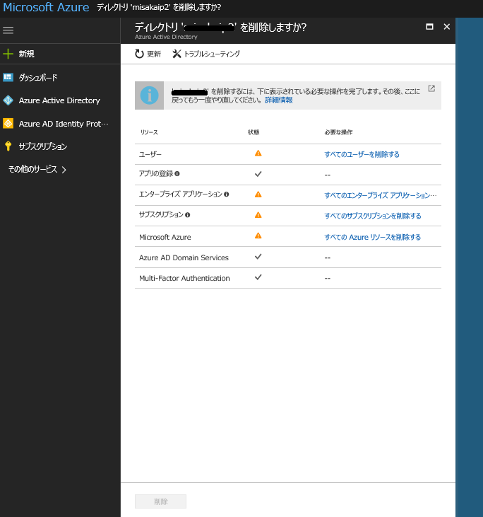

# Azure AD の追加・変更・削除

こんにちは、Azure & Identity サポート チームの坂井です。

今回は下記の 3 つについて紹介します。

- Azure AD の追加手順
- Azure AD の変更手順
- Azure AD の削除手順

まずは、簡単に Azure AD について説明します。

Azure AD とは、Azure や Office 365 などの Microsoft クラウド サービスに組織がサインアップしたときに作成されます (もう少し平易な言い方をすると、 Office 365 など Azure AD が必須のサービスの新規利用を開始した時点で自動的に作成されます)。Azure AD に所属しているユーザーは、その Azure AD に紐づいているクラウドサービスを利用することが可能です。

## Azure AD の追加手順

冒頭で、クラウドサービスにサインアップした際に作成されると書きましたが、Azure AD を個別に追加することも可能です。下記の手順で、Azure AD Free (無料) を作成できます

<手順>

1. https://portal.azure.com より、管理者アカウントでサインインします
2. ポータル画面左上のナビゲーションの [Azure Active Directory] をクリックします
3. 表示された画面の右下より  [ディレクトリの作成] をクリックします
4. [ディレクトリの作成] 画面の下記の項目に入力します

    - 組織名：任意の組織名を入力
    - 初期ドメイン名: <組織> のドメイン名を入力
    - "国/リージョン" を選択

5. [作成] をクリックします
6. 作成が完了すると、"新しいディレクトリを管理するにはここをクリックします" が表示するので、クリックします
7. 新しく作成したディレクトリの画面に切り替わります

作成操作を行ったユーザーが新しく作成した Azure AD ディレクトリ (テナント) の管理者となります。

## Azure AD の変更手順

Azure AD ディレクトリは必ず xxxxx.onmicrosoft.com という名前を持ちますが、このドメイン名を後から変更することはできません。そのため、 Azure AD のディレクトリのドメイン名を例えば contoso.onmicrosoft.com にしたい場合は、上記の「Azure AD の追加手順」の手順に従い、Azure AD を新規に作成する必要があります。

なお、Azure AD の組織名 (よく ”既定のディレクトリ” と表示されている名称) については下記の手順で変更可能です。

<手順>

1. https://portal.azure.com より、管理者アカウントでサインインします
2. ポータル画面左上のナビゲーションの [Azure Active Directory] をクリックします
3. [プロパティ] をクリックします
4. [名前] の項目に新しい組織名を入力します。

    例：既定のディレクトリ --> コントソ株式会社

5. [保存] を押します。
6. 少し時間を空けて再度サインインすると、名前が変更されます。

また、ご利用の Azure サブスクリプションを新規で作成した Azure AD に紐づけたいというような要件がある場合には、サブスクリプションの譲渡とディレクトリの変更の 2 つの方法があります。 

## Azure AD の削除手順

手動で作成した Azure AD については削除が可能です。ディレクトリを削除するためには、いくつか前提条件があります。

<ディレクトリ削除の前提条件>

- Azure のご契約時に自動的に作成されたディレクトリ (既定のディレクトリ) ではない
- ディレクトリにユーザーが存在しない
- 連携するアプリケーションが存在しない
- サブスクリプションが紐づいていない
- など

<手順>

1. https://portal.azure.com より、管理者アカウントでサインインします
2. ポータル画面左上のナビゲーションの [Azure Active Directory] をクリックします
3. [ディレクトリの削除] をクリックします
4. 前提条件のチェック完了後に [削除] をクリックします

削除時に前提条件のチェックが走るため、すべての条件をクリアすることで削除が可能となります。前提条件に抵触している場合は、下記のように ! の警告が表示され削除が完了しません。

なお、Azure のサインアップ時に自動作成された Azure AD  (既定のディレクトリ) やセルフサインアップテナント については削除が想定されていません。そのディレクトリはもう利用することはないが、ユーザーが Azure ポータルにサインインしたときにディレクトリが表示されるので煩わしいという場合には、そのディレクトリからユーザーを削除する方法で対応が可能です。

これにより該当のアカウントでサインインしてもディレクトリは見えなくなりますので、ディレクトリを削除した場合と同等の効果が得られます。

<手順>

1. https://portal.azure.com より、管理者アカウントでサインインします
2. ポータル画面左上のナビゲーションの [Azure Active Directory] をクリックします
3. [ユーザーとグループ] – [すべてのユーザー] をクリックします
4. [＋新しいユーザー] をクリックします
5. ユーザー名を入力し、ロールでは「全体管理者」を選択します

    例) 削除対象のディレクトリ名が contoso.onmicrosoft.com の場合: temp@conotoso.onmicrosoft.com

6. 手順 5. で作成した全体管理者のアカウントで https://portal.azure.com にサインインします
7. [すべてのユーザー] まで移動して、本アカウント以外をこのディレクトリから削除します

削除されたユーザーで、ディレクトリが見えない状態になっているかどうかを確認します。

## 補足

複数の Azure AD は完全に独立したリソースとして管理されます。そのため、Azure AD 間の連携が必要なシナリオの場合は、Azure AD B2B の利用をします。B2B については下記の記事を合わせてご参照ください。

Azure AD B2B とは  
https://blogs.technet.microsoft.com/jpazureid/2017/12/12/about-azure-ad-b2b/

上記内容が少しでも皆様の参考となりますと幸いです。

※本情報の内容（添付文書、リンク先などを含む）は、作成日時点でのものであり、予告なく変更される場合があります。