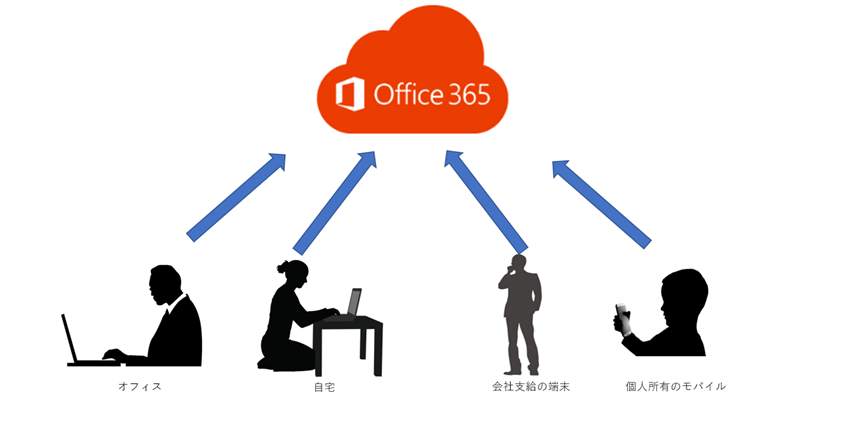

# デバイス ベースのアクセス制御

こんにちは、Azure & Identity サポート チームの下野です。
 
今回は下記の 3 つについてご紹介します。
 
1. AD FS による証明書認証
2. AD FS によるデバイス認証
3. Azure AD によるデバイスベースの条件付きアクセス
 
昨今話題の働き方改革を実現する手段の一つとして、テレワークができる環境を整える - オフィス内で利用する端末だけでなく、会社支給の端末、モバイルデバイスなど多種多様なデバイスから企業のリソースにアクセスできるようにする - ということも有効だと思います。

それを検討する際に、管理者側で会社のリソースにアクセスできるデバイスを限定したいとのご要望をいただくことが多くあります。
そのような要望の実現を検討する際に、今回ご紹介させていただく内容が少しでもお役に立ちましたら幸いです。
 
ではまずは、それぞれの制御方法を説明します。

## 1. AD FS による証明書認証

Windows Server 2012 R2 (AD FS 3.0) 以降で利用可能となった、証明書を使用した認証方式です。ユーザー証明書を各デバイスに配布して、モダン認証 (ADAL) に対応している多くのアプリケーションで利用します。

証明書認証を構成した際に正常に動作しないというケースでは、主に下記のようなポイントをチェックします。

- 証明書のサブジェクト代替名にユーザーの UPN が正しくセットされているか
- AD FS (または WAP) が信頼している証明機関から発行された証明書かどうか
- 証明書の有効期限が切れていないかどうか
- 証明書が、失効されていないかどうか
 
証明書認証を利用できるクライアント端末は次のとおりです。

**対象 OS**: Windows 7, Windows 8.1, Windows 10 ,MAC OS ,iOS ,Android

※ ブラウザーではない Office クライアントなどを利用する場合、[モダン認証 (ADAL)](https://support.office.com/ja-jp/article/office-%E3%82%AF%E3%83%A9%E3%82%A4%E3%82%A2%E3%83%B3%E3%83%88%E3%81%A7-office-365-%E5%85%88%E9%80%B2%E8%AA%8D%E8%A8%BC%E3%82%92%E4%BD%BF%E7%94%A8%E3%81%99%E3%82%8B-776c0036-66fd-41cb-8928-5495c0f9168a) が有効である必要があります。

※ iOS で証明書認証を利用する場合、Microsoft Authenticator をインストールする必要があります。
 
## 2. AD FS によるデバイス認証

AD FS でデバイス認証をおこなうことが可能ですが、これは実際のところ AD FS のクレーム ルールを利用して制御しています。デバイス認証を AD FS で有効にすると、クライアント端末固有の情報をクレームに含めるようになります。それを用いてトークンの発行を許可・拒否するルールを作成し、アクセスの制御を行います。

なお、デバイス認証もモダン認証 (ADAL) に対応している必要がありますが、モバイルのアプリケーションについては、デバイス認証に対応しておりません。

また、後述しますが、AD FS のデバイス認証を利用するためには、デバイスがオンプレミス AD に登録されている必要がございます。デバイス認証を構成し、それが正しく動作していないように見える場合には下記のようなポイントをチェックします。

- Workplace Join を行った際にサインインしていたユーザーで、そのクライアント端末にサインインしているか
- そのユーザーの個人ストアにデバイス認証用の証明書が存在しているか
- オンプレミス AD に対応するデバイス オブジェクトが存在しているか
 
デバイス認証を利用できるクライアント端末は次の通りですが、AD FS のバージョンによって対象が異なるので注意が必要です。
 
<**Windows Server 2016 (AD FS 2016)**>  
対象 OS: Windows 7, Windows 8.1, Windows 10 ,iOS ,Android
 
<**Windows Server 2012 R2 (AD FS 3.0)**>  
対象 OS: Windows 7, Windows 8.1, iOS ,Android
 
 
### 補足

デバイス認証を行うためには前提条件として、オンプレミス AD へのデバイス オブジェクトの登録が必須となります。登録方法は大きく 2 つあり、その 2 つの方法によって対象 OS が異なります。
 
- 方法 1: Azure AD に登録されたデバイスを書き戻す方法

    |方法|Azure AD に登録されたデバイス情報を Azure AD Connect を用いてオンプレミス AD に書き戻す|
    |---|---|
    |対象 OS|Windows 7, Windows 8.1, Windows10, iOS, Android|
 
- 方法 2: AD FS の Device Registration Service (DRS) を利用する方法

    ※ 前提として Windows Server 2012 R2 を AD FS サーバーとして利用している (Windows Server 2016 は非対応)

    |方法|オンプレミス AD に AD FS の DRS を利用してデバイス情報を直接登録する|
    |---|---|
    |対象 OS|Windows 7, Windows 8.1, iOS|

ここで、少し用語について整理します。

AD FS 2012 R2 は、Device Registration Service (DRS) の機能を有します。クライアントからのデバイス登録リクエスト (後述いたします、Workplace Join) を受け、そのクライアント端末に対応するデバイス オブジェクトをオンプレミス AD 内に登録する機能です。また、そのデバイス オブジェクトに紐づいた証明書をクライアントに配布致します。
 
Workplace Join とは、クライアントの機能/動作です。クライアントが DRS に対してデバイス オブジェクトの登録をリクエストする機能、またはその動作のことです。また、Workplace Join は、デバイス オブジェクトの登録に成功した際、DRS から配布された証明書を該当端末にインストールします。
 
AD FS 2012 R2 の DRS は、Windows 7、Windows 8.1、iOS 6 以降、Android 4.0 以降 の Workplace Join に対応しています。AD FS 2016 では、DRS の実装自体はありますが、サポートしていません。AD FS 2016 環境や、クライアントが Windows 10 の場合には、方法 1 の (Azure AD にデバイスを登録し、Azure AD Connect でオンプレミス AD に書き戻す) 必要がございます。

また、基本的にブラウザー アクセスに関しては問題ございませんが、Office クライアントなどのアプリケーションはデバイス認証に対応していません。ブラウザー以外のアプリケーションを利用する場合には、証明書認証や条件付きアクセスのご利用をご検討ください。

## 3. Azure AD によるデバイスベースの条件付きアクセス

Azure AD の「条件付きアクセス」を用いてデバイス ベースのアクセス制御を実装します。条件付きアクセスは、制御対象のアプリケーションがモダン認証 (ADAL) に対応している必要がありますが、簡単にご利用いただけます (ただし、Azure AD Premium のライセンスが必要な点についてはご注意ください)。
 
デバイスベースの条件付きアクセスを利用する前提条件として、制御対象のデバイスを以下いずれかのステータスで、Azure AD 上に登録する必要があります。これによりオンプレミスのドメインに参加している端末や Intune で管理されている端末を条件にアクセス制御が可能です。

|デバイス登録時のステータス|説明|
|----|----|
|ドメイン参加済みデバイス|オンプレミスドメインに参加している端末である|
|準拠済みデバイス|Intune ポリシーにより準拠済みと判定された端末である|

ここで、少し用語について整理します。

**ドメイン参加済みデバイス** とは、オンプレミス AD にドメイン参加しており、AD FS と Azure AD Connect を用いて Azure AD 上にデバイス登録した端末が該当します。実際の構成方法については、[リンク](https://docs.microsoft.com/ja-jp/azure/active-directory/device-management-hybrid-azuread-joined-devices-setup) をご参照ください。

**準拠済みデバイス** とは、Azure AD 上にデバイス登録した上で Intune の MDM 管理を用いて Intune のコンプライアンス ポリシーの準拠した端末が該当します。
 
各種条件を考慮した、それぞれの制御対象 OS は下記になります。

|OS の種類|証明書認証|AD FS デバイス認証|条件付きアクセス|
|-------------|:----:|:----:|:----:|
|Windows 7    |○     |△     |○     |
|Windows 8.1  |○     |△     |○     |
|Windows 10   |○     |△ *1 |○     |
|Mac OS       |○     |×      |○    |
|Android      |○     |△     |○     |
|iOS          |○     |△     |○     |
|Windows Phone|△ *2 |×     |○     |

※ 1: Windows 10 は 前述の通り AD FS 2016 が必要です。また、デバイスの登録方法は、 Azure AD に登録し、書き戻す必要があります。

※ 2: Windows Phone については iOS や Android では利用できる Skype for Business が先進認証に非対応などの制限があります。
 
 
## おわりに

元々、証明書やデバイスによるアクセス制御は、AD FS を中心に行う必要がありました。
現在も証明書による認証をさせたい場合には AD FS が必要ですが、条件付きアクセスは日々機能が拡張されており、新しい機能も次々に追加されています。AD FS の構築、運用の費用と Azure AD Premium のライセンスの兼ね合いもありますが、今後の事も含め、条件付きアクセスを使用したデバイス制御も是非ご検討ください。
 
製品動作に関する正式な見解や回答については、お客様環境などを十分に把握したうえでサポート部門より提供させていただきますので、ぜひ弊社サポートサービスをご利用ください。

※本情報の内容（添付文書、リンク先などを含む）は、作成日時点でのものであり、予告なく変更される場合があります。