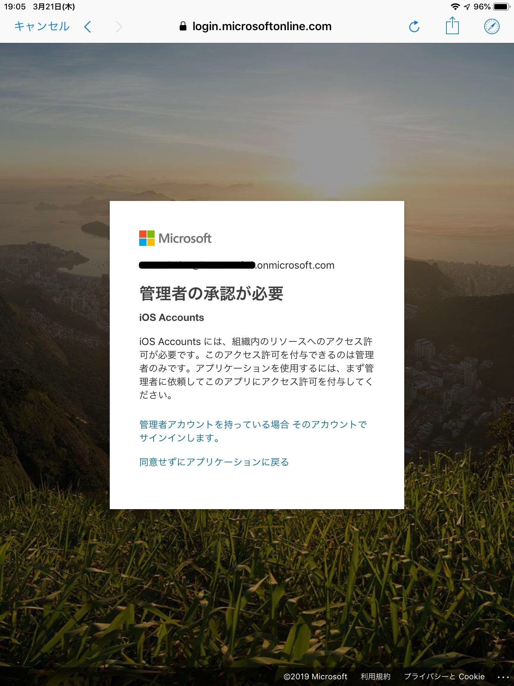
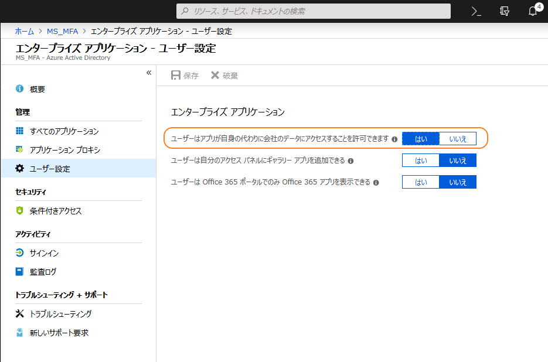

# Office 365 へのアクセスで iOS Accounts 登録のメッセージが表示され接続できない

こんにちは。Azure ID チームの三浦です。
今回は iOS から Office 365 に ActiveSyncなどで接続する際に iOS Accounts 登録に関する画面が表示されて利用できない事象への対応方法をご紹介します。
 
iOS 11 以降では  Office 365 が利用している Azure AD (以降 AAD) に iOS Accounts というアプリケーションを登録し、そのアプリケーションを介して Office 365 への接続をおこない、ユーザーのデータを利用します。
 
テナントの既定の設定では、各ユーザーがテナント上に格納された自身のデータにアクセスすることを許可していますので、自動的に iOS Accounts というアプリケーションが登録され、そのアプリケーションに対して自身のデータへのアクセスを許可することができますが、 Office 365 の AAD で [ユーザーはアプリが自身の代わりに会社のデータにアクセスすることを許可できます] が "いいえ" の場合には、それができず、管理者による承認を必要とします。
  
結果として、 ユーザーが ActiveSync の構成などを実施するタイミングで、次のような画面が iOS 上に表示され、 Office 365 を利用できないという問題が発生します。

####対応策:
AAD の設定で [ユーザーはアプリが自身の代わりに会社のデータにアクセスすることを許可できます] を "はい" にするという方法で対応できますが、これはテナント全体に対する設定であり、その他のアプリケーションにも設定が適用されます。

  

個別に iOS Accounts だけ許可するためには AAD の全体管理者がユーザーの代わりに iOS Accounts アプリがユーザーデータを使用することを承諾するという方法をとります。
具体的な手順は次のとおりですが、この設定は、全体管理者が行う必要がありますので、事前に全体管理者のアカウントをご用意ください。
 
1. iOS で設定を開き、 [パスワードとアカウント] から [アカウントを追加] を行います。

2. Exchange を選択し、メール欄に テナントの全体管理者のアカウントの UPN (ユーザー名) を入力します。
 
3. 確認画面で、[サインイン] をクリックします。

4. パスワードを入力し、 [サインイン] をクリックします。

5. 次のような画面が表示されますので、 "組織の代理として同意する" のチェックを付与し、[承諾] をクリックします。

  

この作業が完了すると Azure AD に iOS Accounts というアプリケーションが登録され、管理者による同意が完了した状態となりますので、他のユーザーのメール セットアップもできるようになります。
この設定は、組織のすべてのユーザーに適用されるため、以降はユーザーにメッセージは表示されません。
 
以上です。