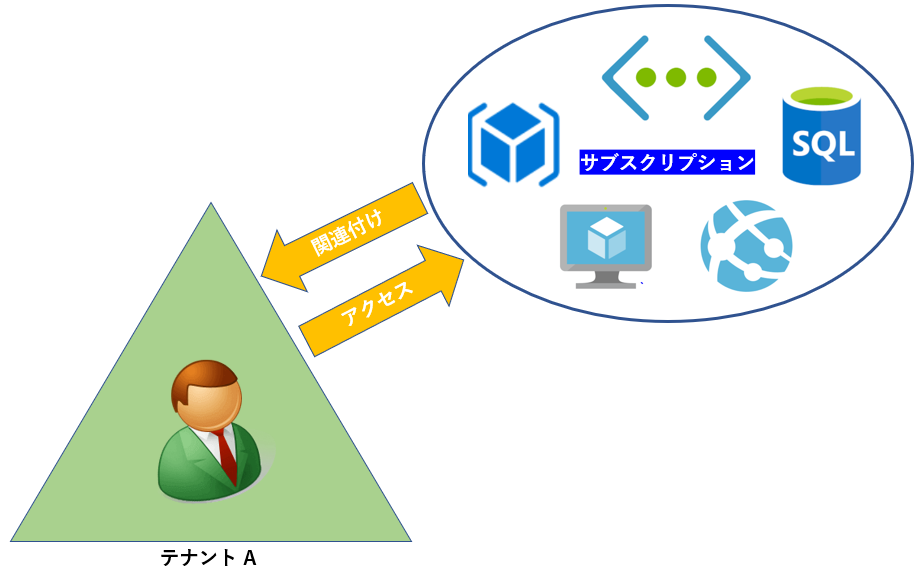
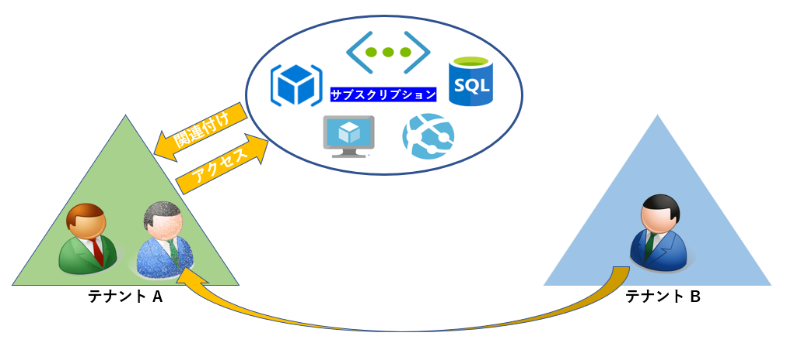
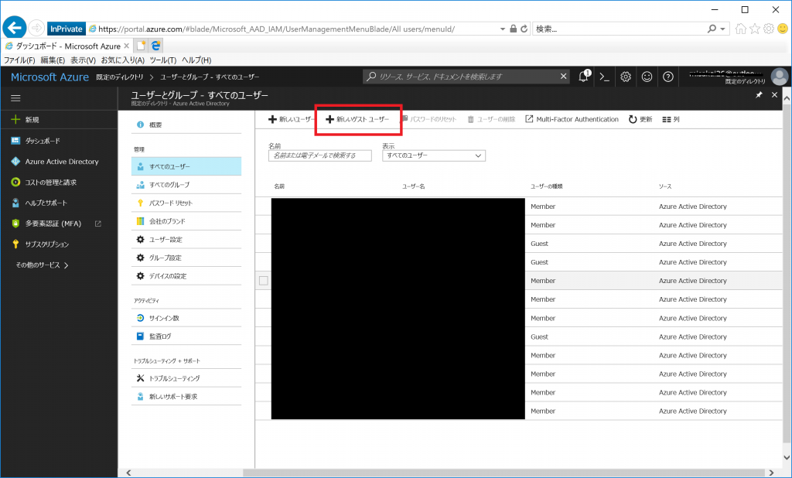
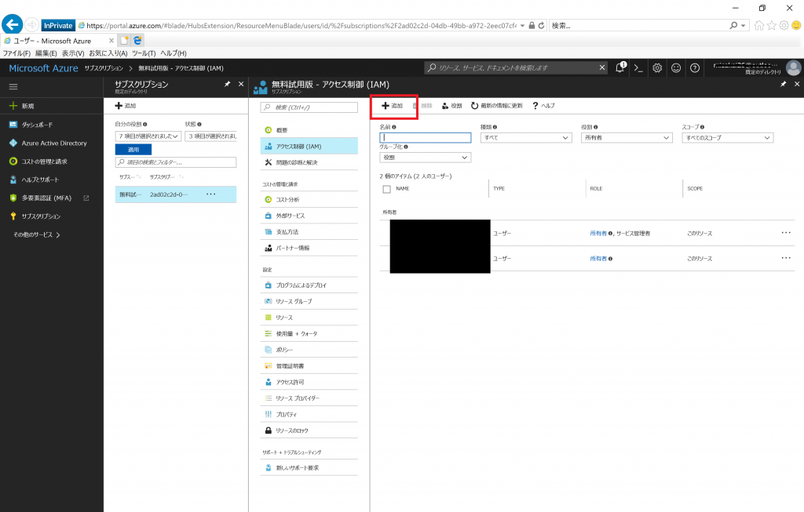

> [!NOTE]
> 本記事は Technet Blog の更新停止に伴い https://blogs.technet.microsoft.com/jpazureid/2017/12/12/about-azure-ad-b2b/ の内容を移行したものです。
> 元の記事の最新の更新情報については、本内容をご参照ください。

# Azure AD B2B とは

こんにちは、Azure & Identity サポート チームの坂井です。

今回は Azure AD B2B (Business-To-Business) コラボレーション機能 (以下、Azure AD B2B) について紹介します。

https://docs.microsoft.com/ja-jp/azure/active-directory/active-directory-b2b-what-is-azure-ad-b2b

この機能については、上記のリンクでも紹介しています。Azure AD B2B と聞くと、もしかしたら小難しく聞こえるかもしれませんが、要は、他 Azure AD のユーザーを追加 (招待) する機能のことです。具体的には、Azure AD を利用する中で、次のような要望がでてくることがあります。

- 会社間 (Azure AD 間) でリソースを共有したい
- 別の Azure AD に紐づいているリソースを使用したい
- ひとりの管理者で、複数の Azure AD を管理したい
- など

このような連携が必要な時に、利用する機能が、今回ご紹介する Azure AD B2B になります。

## はじめに

 Azure サブスクリプションは必ず 1 つの Azure AD に関連付けられています。
そのため、その関連付けられた Azure AD に所属しているユーザーのみがそのサブスクリプションに紐づくリソースを利用可能です。

では、複数の Azure AD がある場合はどのようになるでしょうか。
この場合、別の Azure AD へのアクセスや別の Azure AD に関連付けられているサブスクリプションにアクセスできません。

こんな時、Azure AD B2B を利用することで、別 Azure AD にユーザーを追加 (コピーのようなイメージ) することで、別の Azure AD に所属してリソースを利用することが可能です。

## 詳細

別の Azure AD のユーザーを追加する方法で多く利用されるものを  2  つ紹介します。

### 1. ゲスト ユーザーの追加

明示的に別の Azure AD (または outlook.com や gmail.com などのマイクロソフト アカウント) を追加する操作です。Azure ポータルのメニューより [Azure Active Directory] – [ユーザーとグループ] – [すべてのユーザー] の順に進みます。下記、[新しいゲスト ユーザー] から別の Azure AD のユーザーを追加できます。招待メールが送られ、そのメールよりウィザードを完了する必要があります。

### 2. RBAC (アクセス制御 IAM) によるユーザーの追加

RBAC では、Azure サブスクリプションに紐づけられている Azure AD のユーザーに対してアクセス権を割り当てる必要があります。では、RBAC でアクセス権を割り当てるときに別の Azure AD のユーザーに対してアクセス権を割り当てるときには、先に 1 の作業を実施しておく必要があるのでしょうか？

いいえ、もしユーザーが存在していない場合には、 1 のユーザー追加も合わせて行われます。
Azure ポータルの [サブスクリプション] – [サブスクリプション名] – [アクセス制御 (IAM)]の順に進みます。

下記、[追加] から別の Azure AD のユーザーを追加することができます。招待メールが送られ、そのメールよりウィザードを完了する流れは同様になりますが、同時にサブスクリプションに対するロールを割り当てられます。

## よくあるお問い合わせ

Q. B2B の機能以外で、Azure AD 間を連携することは可能ですか？

A. いいえ、できません。複数の Azure AD 間で同期や複製を行うことはできません。B2B の機能は Azure AD 同士を連携するというよりは、 Azure AD と別 Azure AD のユーザーを連携する機能です。

Q. 別の Azure AD に登録されたアプリケーションを利用するのに、Azure AD B2B の機能を利用できますか？

A. はい、B2B の機能で要件を満たせます。Azure AD B2B の機能で別の Azure AD のユーザーを追加することで、そのユーザーは Azure AD 上のアプリケーションを利用することが可能です。

Q. 旧ポータル (クラシックポータル) のように、個人アカウント (Microsoft アカウント) を明示的に指定して追加することはできますか？

A. いいえ、できません。ただし、 ユーザーのドメイン名が live.com、 hotmail.com、 gmail.com のようなコンシューマー向けのフリーアドレスを利用している場合にはマイクロソフト アカウントが招待されます。
それ以外では 個人アカウントを招待するのではなく、企業アカウントの招待が行われます。
そのため、招待対象のアカウントが個人アカウントであっても Azure ポータルから追加を試みた場合には組織アカウントが招待されます。

また、このときに組織アカウントとして該当のアカウントが存在していない場合には、組織アカウントのユーザー作成処理が試みられます。

## おわりに

今回は、Azure AD B2B に関する概要について紹介しましたが、Azure AD B2B に関するトラブルや Azure AD B2B 完了後のトラブル、または招待メールを利用しない方法などの記事も必要に応じて参照ください。
